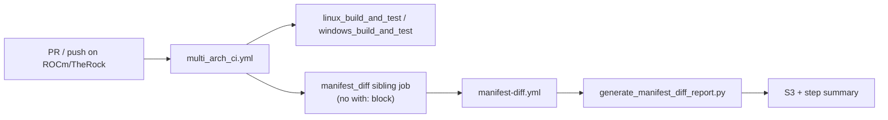
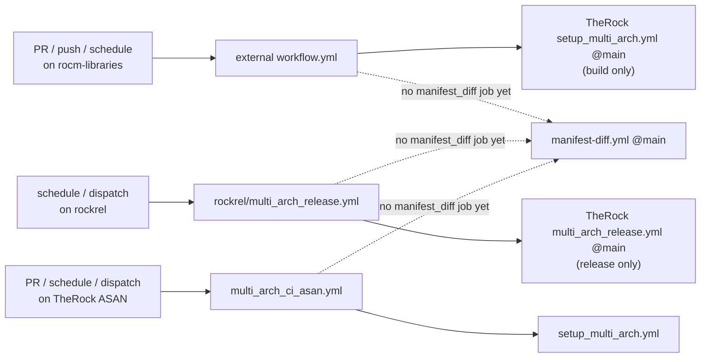
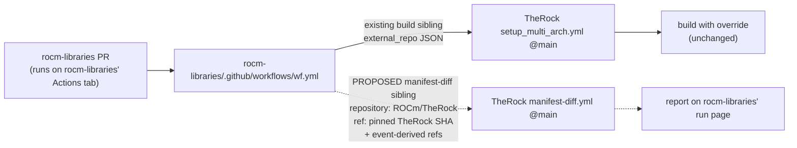
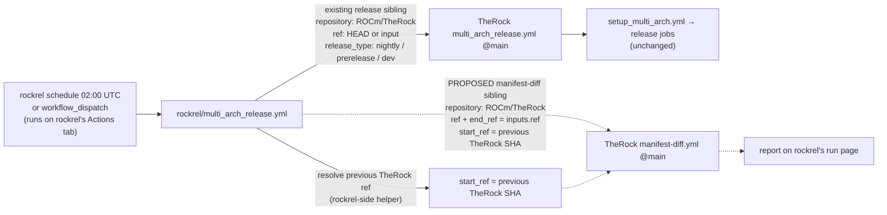

# #5219 - [Feature]: Manifest Diff: External-Repo and Release Nightly Support (rocm-libraries, rocm-systems, rockrel)

**State**: open  
**Author**: amd-hsivasun  
**Created**: 2026-05-12T21:28:27Z  
**Updated**: 2026-05-21T00:13:42Z  
**Labels**: enhancement, don't review, WIP  
**Assignees**: amd-hsivasun  
**URL**: https://github.com/ROCm/TheRock/issues/5219  

---

# Manifest Diff: External-Repo and Release Nightly Support

## 1) Goal

Extend the manifest-diff report (introduced in [#4908](https://github.com/ROCm/TheRock/pull/4908)) so it runs for three caller classes that currently produce no report:

- **External-repo override callers** — `ROCm/rocm-libraries`, `ROCm/rocm-systems` (and future siblings) that override a TheRock submodule via `external_repo_config`.
- **Release driver** — `ROCm/rockrel`, which drives nightly and stable / prerelease ROCm releases by calling `ROCm/TheRock/.github/workflows/multi_arch_release.yml`.
- **TheRock ASAN CI** — `multi_arch_ci_asan.yml` (mechanical follow-up; same shape as main multi-arch CI for PRs).

Today only `multi_arch_ci.yml` fires a report: a top-level **sibling** job `manifest_diff` calls `./.github/workflows/manifest-diff.yml` with no `with:` block — the reusable workflow derives start/end refs from the caller's `github.event`. This issue captures the design questions and concrete approach for each case.

**No impact on external-repo CI today.** #4908's changes are confined to `multi_arch_ci.yml` (TheRock's own CI orchestrator), the new reusable `manifest-diff.yml`, and supporting tooling. External callers (`rocm-libraries`, `rocm-systems`, rockrel) invoke `setup_multi_arch.yml` / `multi_arch_release.yml`, neither of which #4908 modifies. None of those pipelines change behavior — adding manifest-diff coverage to them is purely additive future work tracked here.

---

## 2) Caller Classes & Coverage

| Caller class              | Examples                         | `external_repo_config` | `github.repository` in caller context | Calls into TheRock via                                      | Manifest diff today? |
| ------------------------- | -------------------------------- | ---------------------- | ------------------------------------- | ----------------------------------------------------------- | :------------------: |
| TheRock main CI           | `ROCm/TheRock`                   | empty                  | `ROCm/TheRock`                        | `multi_arch_ci.yml` → `manifest-diff.yml` (sibling)         |         Yes          |
| External-repo override    | `rocm-libraries`, `rocm-systems` | non-empty JSON         | the external repo                     | `setup_multi_arch.yml`, `multi_arch_ci_*.yml` (build only)    |          No          |
| Release driver            | `rockrel`                        | empty                  | `ROCm/rockrel`                        | `multi_arch_release.yml@main`                               |          No          |
| TheRock ASAN CI           | `ROCm/TheRock`                   | empty                  | `ROCm/TheRock`                        | `multi_arch_ci_asan.yml` → `setup_multi_arch.yml` (no diff) |          No          |

Coverage is decided per **caller workflow**: each workflow that wants a report adds a sibling job that invokes `manifest-diff.yml` directly.

### `ROCm/TheRock` main CI (works today)



Event-derived refs inside `manifest-diff.yml`:

| Event          | End ref                     | Start ref source                                      |
| -------------- | --------------------------- | ----------------------------------------------------- |
| `pull_request` | `pull_request.head.sha`     | merge-base via `--pr-base-ref` (Compare API)          |
| `push`         | `github.sha`                | `github.event.before`                                 |

Start-resolution precedence in the script: `--pr-base-ref` > `--find-last-run` > `--start`. See [`docs/development/manifest_diff.md`](docs/development/manifest_diff.md).

### External-repo, rockrel, ASAN (not wired today)



The shared piece is [`manifest-diff.yml`](.github/workflows/manifest-diff.yml). What changes per caller is **which workflow adds the sibling job** and **which inputs that job passes** (especially target repo for API calls, TheRock checkout ref, and how the start ref is resolved).

---

## 3) Recommended Pattern: Sibling Job → `manifest-diff.yml@main`

Every caller that wants a report adds a **parallel sibling job** (no `needs:`, same shape as `multi_arch_ci.yml`) invoking `ROCm/TheRock/.github/workflows/manifest-diff.yml@main` with explicit `with:` inputs per event.

Rationale:

- Matches the architecture already proven in `multi_arch_ci.yml`.
- Cross-repo callers (external repos, rockrel) already use `uses: ROCm/TheRock/.github/workflows/...@main`; adding a second sibling call is the same pattern.
- Release baseline resolution (two-layer: "previous release run → TheRock ref") naturally lives in the **orchestrator** (rockrel, or TheRock on manual dispatch), which passes an explicit `start_ref` — the script's `--find-last-run` resolves a run's `head_sha`, not a prior run's `inputs.ref`.
- `manifest-diff.yml` references local paths (`./.github/actions/configure_aws_artifacts_credentials`, `build_tools/generate_manifest_diff_report.py`); cross-repo callers must pass `repository: ROCm/TheRock` and `ref:` (pinned TheRock SHA) so the reusable workflow checks out the right tree.

`manifest-diff.yml` input surface: `start_ref`, `end_ref`, `workflow_mode`, `find_last_run`, `pr_base_ref`, `branch`, `repository`, `ref`. Terminal-run filtering (`success` / `failure`) is hardcoded in `generate_manifest_diff_report.py`.

---

## 4) Case 1: External-Repo Override Callers

### 4.0) Open question — is this case worth shipping?

For most external-repo PRs the report largely duplicates what the PR's own GitHub "Files changed" view already shows. The genuinely novel cases are narrow:

- A `rocm-libraries` / `rocm-systems` PR that **also** wants to bump the TheRock pin (rare).
- **Multi-override schedule runs** that override two or more external repos at once (no current driver does this).
- Reviewers who prefer the unified TheRock-manifest framing over per-repo PR views (taste, not function).

**Demand-check with rocm-libraries / rocm-systems reviewers before building either option below.** Everything from §4.1 onward assumes we decide it's worth doing.

### 4.1) How external-repo callers drive TheRock CI today, and where manifest-diff would slot in

The run executes on the **caller's** Actions tab (e.g. `rocm-libraries`), with `github.repository = ROCm/rocm-libraries`. The proposed manifest-diff sibling lives in the caller's top-level workflow alongside the existing build sibling — both are cross-repo `uses:` into TheRock's reusable workflows.



Background on the existing build sibling (unchanged by anything in this issue):

- Each external repo carries its own `.github/scripts/` with `therock_matrix.py` and `therock_configure_ci.py`.
- The external workflow calls TheRock's reusable workflows with a JSON `external_repo` input; `setup_multi_arch.yml` runs [`detect_external_repo_config.py`](build_tools/github_actions/detect_external_repo_config.py) to produce `external_repo_config`: `{ repository, ref, checkout_path, source_package, fetch_sources_args }`.
- The reusable workflows check out TheRock at its pinned ref **and** the external repo at the supplied ref, then pass `-DTHEROCK_{SOURCE_PACKAGE}_SOURCE_DIR=<checkout_path>` to CMake.
- `configure_multi_arch_ci.py` sets `SKIP_PATH_FILTERS=true` for these runs (TheRock's git-SHA path filter can't apply to external-repo SHAs).

### 4.2) What breaks if we wire manifest-diff without script changes

The proposed sibling job runs on **rocm-libraries' (or rocm-systems') Actions tab**, with `github.repository = ROCm/rocm-libraries` by default. The script's defaults all assume `github.repository == ROCm/TheRock`, which is true today only because the only wired caller is `multi_arch_ci.yml` inside TheRock. As soon as a non-TheRock caller invokes the workflow:

1. **Wrong source of truth.** `build_manifest_schema(THEROCK_DIR, sha)` reads pinned submodule SHAs from TheRock's git tree. When `-DTHEROCK_ROCM_LIBRARIES_SOURCE_DIR=...` overrides the submodule, the manifest still reports the *pinned* SHA, not the overridden one. The diff between two TheRock commits then shows nothing for `rocm-libraries` even though that's the only repo that changed.
2. **Refs live in the wrong repository.** For a `rocm-libraries` PR, `head.sha`, `base.ref`, and `event.before` all refer to `ROCm/rocm-libraries`. Today's `--pr-base-ref` calls the Compare API on hardcoded `ROCm/TheRock` — a 404 for external-repo SHAs.
3. **`find_last_run` baseline ambiguity.** For a scheduled run on `rocm-libraries`, "last matching workflow run" lives on the external repo's actions tab, not TheRock's. `gha_query_last_workflow_run` defaults to `ROCm/TheRock`; the calling workflow filename may not even exist in TheRock.
4. **Multi-override runs.** Nothing prevents overriding **both** `rocm-libraries` and `rocm-systems` in one run. The current report is one HTML page; we have no story for two-or-more simultaneously-overridden repos without an override-aware virtual manifest.

The fix is the new `--repository` flag and `external_repo_config` plumbing in §4.3 / §4.4 — explicitly point script API calls at the caller's repo, and pass the override JSON through to the manifest builder.

### 4.3) Design questions

**Q1 — What does the diff actually compare?** Concretely, given a `rocm-libraries` PR where `base = abc1`, `head = def2`, run inside TheRock at TheRock's pinned ref `T@1`:

**Option (a) — External-repo-only diff.** Ignore TheRock's manifest entirely. Walk `abc1..def2` in `ROCm/rocm-libraries` and render that commit range as the report.

- Report content: single section, "rocm-libraries: abc1..def2".
- Files changed:
  - `build_tools/generate_manifest_diff_report.py` — add `--external-repo` mode that bypasses `build_manifest_schema` and walks one repo's history.
  - `.github/workflows/manifest-diff.yml` — add `external_repo` input.
- Limitation: a `rocm-libraries` PR that *also* requires an `llvm-project` bump pinned in TheRock would only show the rocm-libraries half.

**Option (b) — Override-aware virtual manifest.** Synthesize two virtual TheRock manifests: a "start" manifest where the `rocm-libraries` submodule entry is replaced with `(ROCm/rocm-libraries, abc1)`, and an "end" manifest with `(ROCm/rocm-libraries, def2)`. Run the existing manifest-diff logic over the virtual manifests.

- Report content: same layout as today's TheRock-internal report. All non-overridden submodules show unchanged; the overridden one shows its commit range. Multi-override runs Just Work because the manifest can carry multiple overrides.
- Files changed:
  - `build_tools/generate_therock_manifest.py` (or a wrapper) — `build_manifest_schema` learns to apply overrides supplied by the caller.
  - `build_tools/generate_manifest_diff_report.py` — pass overrides through; add `--repository` so Compare / workflow-runs API calls hit the external repo where appropriate.
  - `.github/workflows/manifest-diff.yml` — add `external_repo_config` input (or individual override fields).

**Option (c) — Both, side-by-side.** Render (a) and (b) as two sections of one HTML page. TheRock's pinned-submodule changes on top (probably "no changes"), the override's commit range below.

- Files changed: superset of (a) + (b), plus a template change in `build_tools/manifest_diff_report_template.html`.
- Useful only when a PR touches TheRock infra *and* an overridden repo, which is rare.

**My recommendation: (b).** It keeps the report layout consistent with TheRock-internal runs, generalizes to multi-override runs without extra plumbing, and the only non-trivial code change (teaching the manifest builder about overrides) is the one we'd have to do for (c) anyway.

**Q2 — Where does the baseline come from?**

| Event          | Baseline source                                                                        |
| -------------- | -------------------------------------------------------------------------------------- |
| `pull_request` | Merge-base on the external repo, via Compare API on `external_repo_config.repository`. |
| `push`         | `event.before` on the external repo.                                                   |
| `schedule`     | Last terminal-status run of the external repo's calling workflow on that repo's Actions API. |

In all three cases `--pr-base-ref` and `--find-last-run` need a `--repository` (or equivalent workflow input) so the API calls hit the external repo, not hardcoded `ROCm/TheRock`.

### 4.4) Inputs into `manifest-diff.yml@main` for this case

Assuming (b), the external repo's top-level workflow adds a sibling job (alongside its existing call into `setup_multi_arch.yml@main`). Cross-repo invocation with event-derived refs:

```yaml
manifest_diff:
  name: Manifest Diff
  uses: ROCm/TheRock/.github/workflows/manifest-diff.yml@main
  with:
    repository: ROCm/TheRock
    ref: ${{ <pinned TheRock ref used for this CI run> }}
    end_ref: ${{ github.event_name == 'pull_request' && github.event.pull_request.head.sha || github.sha }}
    pr_base_ref: ${{ github.event_name == 'pull_request' && github.event.pull_request.base.ref || '' }}
    start_ref: ${{ github.event_name == 'push' && github.event.before || '' }}
    find_last_run: ${{ github.event_name == 'schedule' && github.workflow || '' }}
    branch: ${{ github.ref_name }}
    # Planned (script support required):
    # external_repo_config: ${{ <JSON from detect_external_repo_config, or the caller's external_repo input> }}
  permissions:
    contents: read
    id-token: write
```

The script runs Compare-API / workflow-runs lookups against the **external** repo (via new `--repository` flag) and renders an override-aware manifest (via `external_repo_config`). The `repository` / `ref` inputs on the workflow checkout TheRock at the pinned ref so local script paths resolve.

### 4.5) Files that will change

- `build_tools/generate_therock_manifest.py` — override-aware manifest builder.
- `build_tools/generate_manifest_diff_report.py` — `--repository` flag; pass `external_repo_config` overrides through to manifest builder.
- `build_tools/github_actions/github_actions_api.py` — `gha_query_last_workflow_run` already accepts `github_repository`; wire callers to pass the external repo.
- `.github/workflows/manifest-diff.yml` — `external_repo_config` input; plumb `--repository` to the script.
- **External-repo workflows** (e.g. `rocm-libraries/.github/workflows/...`, `rocm-systems/.github/workflows/...`) — add sibling `manifest_diff` job invoking `ROCm/TheRock/.github/workflows/manifest-diff.yml@main` as above.

---

## 5) Case 2: rockrel Release Driver

### 5.1) How rockrel drives TheRock CI today, and where manifest-diff would slot in

The run executes on **rockrel's** Actions tab, with `github.repository = ROCm/rockrel`. The proposed manifest-diff sibling lives alongside the existing release call in rockrel's top-level workflow — both are cross-repo `uses:` into TheRock's reusable workflows. TheRock's release chain is unchanged.



- [`ROCm/rockrel/.github/workflows/multi_arch_release.yml`](https://github.com/ROCm/rockrel/blob/main/.github/workflows/multi_arch_release.yml) does `uses: ROCm/TheRock/.github/workflows/multi_arch_release.yml@main` with `repository: ROCm/TheRock`, an optional `ref:`, and a `release_type` of `dev` / `nightly` / `prerelease`.
- Triggers: nightly `schedule` (02:00 UTC) and `workflow_dispatch` for stable / prerelease.
- No `external_repo_config`. In the rockrel workflow context, `github.repository` is `ROCm/rockrel`.

### 5.2) Why this is a different problem from Case 1

- **Manifest is correct.** rockrel just passes a TheRock `ref`; no overrides, no `THEROCK_*_SOURCE_DIR` flags. The existing `build_manifest_schema` works as-is.
- **Two-layer ref resolution.** The interesting diff is "TheRock between the last successful rockrel release and this one." That requires: query **rockrel's** actions for the last accepted run, find *that* run's TheRock ref (from `inputs.ref`), then diff TheRock between that ref and the current ref. `--find-last-run` today resolves start as the previous run's `head_sha` (rockrel's SHA), not the TheRock ref that run released.
- **`workflow_dispatch` baseline is ambiguous.** For manual stable / prerelease runs: previous nightly? Previous stable? An explicit input?
- **`pull_request` / `push` don't apply.** rockrel doesn't take PRs that drive a TheRock build.

### 5.3) Design questions

**Q1 — Which runs produce a diff?**

| rockrel event                                  | Diff?  | Baseline                                                              |
| ---------------------------------------------- | ------ | --------------------------------------------------------------------- |
| `schedule` (nightly)                           | yes    | TheRock ref of the previous successful nightly                        |
| `workflow_dispatch`, `release_type=prerelease` | opt-in | TheRock ref of the previous successful prerelease (or explicit input) |
| `workflow_dispatch`, `release_type=dev`        | no     | —                                                                     |
| `push` to rockrel `main`                       | no     | —                                                                     |

**My recommendation:** nightly always; prerelease opt-in via an input; others skip.

**Q2 — How do we resolve the previous rockrel run's TheRock ref?**

rockrel resolves this on its side (query its own workflow-runs API, filter by `release_type`, read the prior run's `inputs.ref`) and passes the result as explicit `start_ref` into `manifest-diff.yml@main`. TheRock-side script changes are limited to optionally adding a shared CLI helper later (`build_tools/resolve_previous_release_ref.py`) that any release driver can call — not a blocker for the first wiring.

**Q3 — Where does the report surface?**

| Surface                                                     | Notes                                                     |
| ----------------------------------------------------------- | --------------------------------------------------------- |
| Step summary on the rockrel workflow run                    | Trivial; uses the same upload step.                       |
| Linked from release artifacts at `rocm.prereleases.amd.com` | Follow-up; needs coordination with release tooling.       |
| GitHub release notes on `ROCm/rockrel` releases             | Open question — do those releases get GH Release objects? |

**Q4 — Where does the code live?**

The report generator stays in TheRock, reused by rockrel via `manifest-diff.yml@main` with rockrel passing the right inputs. Avoid forking the script into rockrel.

### 5.4) Recommended wiring

Example sibling job inputs (the integration is shown in §5.1's diagram):

```yaml
manifest_diff:
  name: Manifest Diff
  if: ${{ inputs.release_type == 'nightly' || (inputs.release_type == 'prerelease' && inputs.generate_manifest_diff == 'true') }}
  uses: ROCm/TheRock/.github/workflows/manifest-diff.yml@main
  with:
    repository: ROCm/TheRock
    ref: ${{ inputs.ref || 'main' }}
    end_ref: ${{ inputs.ref }}
    start_ref: ${{ needs.resolve_baseline.outputs.therock_ref }}
  permissions:
    contents: read
    id-token: write
```

(`resolve_baseline` is a preceding job or step in rockrel that queries rockrel's own Actions API — exact shape TBD in rockrel PR.)

### 5.5) Files that will change

- **rockrel:**
  - `.github/workflows/multi_arch_release.yml` — add baseline-resolution step/job; add parallel `manifest_diff` sibling calling `manifest-diff.yml@main`.
  - A small helper (e.g. `build_tools/resolve_previous_release_ref.py`) to compute the previous release's TheRock ref from rockrel's workflow-runs history.
- **TheRock:**
  - **Zero workflow changes** for the rockrel path. Optional later: ship the resolve helper in TheRock for reuse by other release drivers.

---

## 6) Case 3: TheRock ASAN CI (`multi_arch_ci_asan.yml`)

### 6.1) Situation

`multi_arch_ci_asan.yml` mirrors main multi-arch CI structurally (`setup` → `linux_build_and_test` → `ci_summary`) but has **no** `manifest_diff` sibling. Triggers: `schedule` (02:00 UTC nightly), `workflow_dispatch`, and `pull_request` (labeled / opened / synchronize).

For **`pull_request`**, the fix is mechanical: copy the exact sibling job from `multi_arch_ci.yml` — no `with:` block, refs derived from the event inside `manifest-diff.yml`.

For **`schedule`**, there is no `github.event.before` and no `pull_request.base.ref`. A literal copy/paste yields an empty start ref. Pass `find_last_run: multi_arch_ci_asan.yml` (and `branch: main`) in the `with:` block for schedule events.

For **`workflow_dispatch`**, same gap as main CI: without explicit inputs the job goes yellow via `continue-on-error` — acceptable; manual dispatch of ASAN is not a supported way to produce a report (dispatch `manifest-diff.yml` directly instead).

### 6.2) Recommended wiring

```yaml
manifest_diff:
  name: Manifest Diff
  uses: ./.github/workflows/manifest-diff.yml
  with:
    find_last_run: ${{ github.event_name == 'schedule' && 'multi_arch_ci_asan.yml' || '' }}
    branch: main
  permissions:
    contents: read
    id-token: write
```

PR events ignore the empty `find_last_run` string (script normalizes blank → not provided); `--pr-base-ref` wins via event derivation.

### 6.3) Files that will change

- `.github/workflows/multi_arch_ci_asan.yml` — add `manifest_diff` sibling job (above).
- Optionally `build_tools/github_actions/configure_ci_path_filters.py` — add `multi_arch_ci_asan.yml` workflow-only path filter entry if not already present.

No script changes required for the ASAN path.

---

## 7) Related

- [#4908](https://github.com/ROCm/TheRock/pull/4908) — initial implementation; wires `manifest_diff` sibling in `multi_arch_ci.yml`.
- [`docs/development/manifest_diff.md`](docs/development/manifest_diff.md) — design doc for the report.
- Caller workflows:
  - [`.github/workflows/multi_arch_ci.yml`](.github/workflows/multi_arch_ci.yml) — wired today.
  - [`.github/workflows/multi_arch_ci_asan.yml`](.github/workflows/multi_arch_ci_asan.yml) — Case 3.
  - [`ROCm/rockrel/.github/workflows/multi_arch_release.yml`](https://github.com/ROCm/rockrel/blob/main/.github/workflows/multi_arch_release.yml) — Case 2.
  - External-repo workflows in `ROCm/rocm-libraries`, `ROCm/rocm-systems` — Case 1.
- [`build_tools/github_actions/detect_external_repo_config.py`](build_tools/github_actions/detect_external_repo_config.py) — external-repo override JSON schema.
- [`build_tools/github_actions/github_actions_api.py`](build_tools/github_actions/github_actions_api.py) — `gha_query_last_workflow_run()` used by `--find-last-run`.
