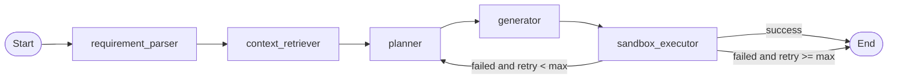

TestCaseAgent - 加入沙盒运行节点设计

设计与开发说明文档（结合当前项目的最小侵入版）

版本: v3.1
日期: 2026-05-25
状态: 设计定稿，可按阶段落地

## 1. 设计目标

在当前线性工作流基础上加入沙盒执行验证与自动修复闭环。

当前主链路:

```text
requirement_parser -> context_retriever -> planner -> generator -> END
```

目标主链路:

```text
requirement_parser -> context_retriever -> planner -> generator -> sandbox_executor
sandbox_executor success -> END
sandbox_executor failed 且未超限 -> planner
sandbox_executor failed 且超限 -> END
```

核心原则:

- 保留当前项目已有节点形态，不强制重写为 Runnable Chain。
- 保留现有状态字段 `case_plan`、`generated_code`、`execution_result`，不新增 `plan` 作为主字段。
- 新增 `sandbox_executor` 节点负责执行验证，不把沙盒执行工具暴露给 LLM 自主调用。
- 失败回退到 `planner`，让 LLM 从测试策略层面重新规划。
- 默认实现 `remote_ssh_docker` provider，把生成代码推到远端 AMD/ROCm 主机执行；`local_docker` 仅作为普通 Python 用例和本地调试 fallback。
- 沙盒执行优先使用 `state["generated_code"]` 字符串，不依赖本地保存文件。

## 2. 当前项目现状

当前已有关键文件:

```text
src/agent/state.py
src/agent/graph.py
src/agent/runner.py
src/agent/nodes/__init__.py
src/agent/nodes/node_requirement_parser.py
src/agent/nodes/node_context_retriever.py
src/agent/nodes/node_planner.py
src/agent/nodes/node_generator.py
src/agent/nodes/node_sandbox_executor.py
src/agent/prompts.py
src/agent/promot/node_planner.md
src/agent/cli/cli_runner.py
```

现状判断:

- `node_sandbox_executor.py` 已存在但为空，适合作为新增运行节点的落点。
- `state.py` 已有 `execution_result`，无需新增同名字段。
- `state.py` 已有 `retry` / `repair_count`，但沙盒重试建议单独使用 `sandbox_retry_count`，避免和已有语义混用。
- `graph.py` 当前使用 `StateGraph.add_edge()` 线性编排，建议继续沿用 `add_conditional_edges()`，不要为了本功能强制迁移到 `Command`。
- `node_planner.py` 当前输出 `case_plan`，`node_generator.py` 当前读取 `case_plan`，因此不要改成 `plan`。
- `node_generator.py` 当前会保存代码到本地 `test_case/`。第一阶段可保留，沙盒执行节点使用 `generated_code` 即可。
- `cli_runner.py` 当前只展示 4 个节点，需要加入 `sandbox_executor` 的展示逻辑。

## 3. 工作流拓扑



注意：`failed and retry >= max -> END` 表示“终止在失败态”，不是成功。最终结果必须以
`execution_result.status` 为准；`validation_result.status` 只代表 generator 阶段的生成代码校验，
不能作为沙盒验证是否通过的依据。

| 指标 | 设计 |
| --- | --- |
| 节点数 | 5 个 |
| 主干边 | 4 条 |
| 条件边 | 1 条，从 `sandbox_executor` 出发 |
| 回退点 | `planner` |
| 默认重试上限 | `max_sandbox_retries = 3` |
| 默认 provider | `remote_ssh_docker` |

## 4. 状态设计

`AgentState` 当前是 `TypedDict(total=False)`，建议在原字段上增量添加沙盒字段。

建议保留的现有核心字段:

```python
messages: Annotated[list, operator.add]
requirement: str
parsed_requirement: str
context: dict[str, Any]
case_plan: str
code: str
generated_code: str
explanation: str
validation_result: dict[str, Any]
execution_result: dict[str, Any]
parsed_result: dict[str, Any]
repair_suggestion: str
final_report: dict[str, Any]
retry: Annotated[int, operator.add]
repair_count: Annotated[int, operator.add]
```

建议新增字段:

```python
sandbox_config: dict[str, Any]
"""沙盒配置，例如 provider、image、timeout、block_network。"""

sandbox_id: str
"""当前沙盒实例 ID。remote_ssh_docker/local_docker 下可对应 container id。"""

sandbox_retry_count: int
"""沙盒执行失败后的策略重试次数。不要复用 retry 字段。"""

max_sandbox_retries: int
"""沙盒验证最大重试次数，默认 3。"""

feedback: str
"""sandbox_executor 失败时生成，planner 重规划时消费。"""

error_log: Annotated[list[str], operator.add]
"""沙盒失败历史，供最终报告和调试使用。"""

saved_filepath: str
"""generator 当前保存的本地文件路径。已有返回值可补充到 state 类型中。"""
```

`execution_result` 推荐结构:

```python
{
    "status": "success" | "failed",
    "stage": "sandbox_create" | "upload" | "dependency" | "pytest" | "timeout",
    "stdout": "...",
    "stderr": "...",
    "exit_code": 0,
    "error": None,
    "provider": "remote_ssh_docker",
    "duration_seconds": 1.23,
}
```

## 5. 新增 Python 文件设计

### 5.1 `src/agent/nodes/node_sandbox_executor.py`

新增核心 LangGraph 节点。节点只负责编排，不直接承载 Docker/Modal 细节。

职责:

- 读取 `state["generated_code"]`。
- 读取 `state["sandbox_config"]`。
- 通过 `build_sandbox_client()` 获取沙盒 client。
- 创建或复用沙盒。
- 上传代码到沙盒。
- 安装基础依赖。
- 执行 pytest。
- 返回 `execution_result`。
- 失败时返回 `feedback`、`error_log`、递增 `sandbox_retry_count`。

建议函数签名:

```python
from ..state import AgentState


def sandbox_executor(state: AgentState) -> dict:
    """Run generated pytest code in an isolated sandbox."""
    ...
```

### 5.2 `src/agent/sandbox/base.py`

新增沙盒抽象层，保证 provider 可替换。

建议定义:

```python
from abc import ABC, abstractmethod
from dataclasses import dataclass, field


@dataclass(frozen=True)
class SandboxConfig:
    provider: str = "remote_ssh_docker"
    image: str = "rocm/dev-ubuntu-22.04:6.0"
    timeout: int = 120
    block_network: bool = False
    env_vars: dict[str, str] = field(default_factory=dict)
    remote_host: str = "10.67.69.34"
    remote_user: str = "jenkins"
    remote_password: str = "0"
    remote_work_dir: str = "/tmp/testcase_agent"
    device_name: str = "/dev/kfd,/dev/dri"


@dataclass(frozen=True)
class SandboxHandle:
    sandbox_id: str
    provider: str


@dataclass(frozen=True)
class CommandResult:
    exit_code: int
    stdout: str
    stderr: str
    duration_seconds: float = 0.0


class SandboxClient(ABC):
    @abstractmethod
    def create(self, config: SandboxConfig, sandbox_id: str | None = None) -> SandboxHandle:
        """Create or reuse a sandbox."""

    @abstractmethod
    def upload_text(self, handle: SandboxHandle, content: str, remote_path: str) -> None:
        """Upload text content to the sandbox."""

    @abstractmethod
    def exec(self, handle: SandboxHandle, command: str, timeout: int) -> CommandResult:
        """Execute a command in the sandbox."""

    @abstractmethod
    def destroy(self, handle: SandboxHandle) -> None:
        """Destroy the sandbox."""
```

### 5.3 `src/agent/sandbox/remote_ssh_docker.py`

默认 provider，用于需要 AMD GPU/ROCm 设备的用例验证。

职责:

- 使用 `ssh jenkins@10.67.69.34` 进入远端 AMD 主机。
- 通过 `sshpass -e` 支持密码登录，默认密码为 `0`；也可清空密码改用 SSH key。
- 先把生成代码推送到远端主机临时目录，再 `docker cp` 到容器内。
- `docker run` 必须带 `DEVICE_NAME='/dev/kfd,/dev/dri'`，并挂载 `--device /dev/kfd --device /dev/dri`。
- 执行 `python -m pip install pytest -q`。
- 执行 `python -m pytest test_generated.py -v`。
- 收集 stdout、stderr、exit_code。

实现建议:

- 本地开发机不要求 AMD GPU/ROCm，只要求能 SSH 到远端执行主机。
- 远端容器默认工作目录为 `/tmp/testcase_agent`。
- 默认镜像为 `rocm/dev-ubuntu-22.04:6.0`；如远端已有内部 ROCm 镜像，可通过 `TEST_CASE_AGENT_SANDBOX_IMAGE` 覆盖。
- `local_docker` 保留给不需要硬件设备的普通 Python 用例。

### 5.4 `src/agent/sandbox/factory.py`

根据 `sandbox_config["provider"]` 选择 client。

```python
from .base import SandboxClient
from .local_docker import LocalDockerSandboxClient
from .remote_ssh_docker import RemoteSshDockerSandboxClient


def build_sandbox_client(provider: str) -> SandboxClient:
    if provider == "local_docker":
        return LocalDockerSandboxClient()
    if provider == "remote_ssh_docker":
        return RemoteSshDockerSandboxClient()
    raise ValueError(f"Unsupported sandbox provider: {provider}")
```

### 5.5 `src/agent/sandbox/feedback.py`

构造给 planner 的策略反馈，避免把完整 pytest 日志原样塞给 LLM。

建议识别:

- `ModuleNotFoundError`
- `ImportError`
- `SyntaxError`
- `pytest collection failed`
- `command not found`
- `FileNotFoundError`
- timeout
- exit code 非 0

反馈示例:

```text
[pytest] 沙盒验证失败。
错误类型: ModuleNotFoundError
关键日志: No module named 'requests'
建议: 重新评估依赖安装策略，或避免非标准库依赖。
这是第 1 次重试，请输出完整新计划，不要只输出 diff。
```

### 5.6 `src/agent/sandbox/__init__.py`

导出公共接口:

```python
from .base import CommandResult, SandboxClient, SandboxConfig, SandboxHandle
from .factory import build_sandbox_client
```

### 5.7 后续可选文件

```text
src/agent/sandbox/modal.py
src/agent/sandbox/runloop.py
src/agent/sandbox/daytona.py
```

这些不建议第一阶段实现。硬件相关用例默认先走 `remote_ssh_docker` 打通闭环。

## 6. 现有文件改动建议

### 6.1 `src/agent/state.py` - 必须改

新增沙盒字段:

```python
sandbox_config: dict[str, Any]
sandbox_id: str
sandbox_retry_count: int
max_sandbox_retries: int
feedback: str
error_log: Annotated[list[str], operator.add]
saved_filepath: str
```

注意:

- 不要把 `case_plan` 改名为 `plan`。
- 不要把 `retry` 改造成沙盒重试计数。
- `execution_result` 已存在，补充结构说明即可。

### 6.2 `src/agent/graph.py` - 必须改

新增节点:

```python
builder.add_node("sandbox_executor", sandbox_executor)
```

修改边:

```python
builder.add_edge("planner", "generator")
builder.add_edge("generator", "sandbox_executor")
```

新增条件路由:

```python
def route_after_sandbox(state: AgentState) -> str:
    result = state.get("execution_result", {})
    if result.get("status") == "success":
        return END
    if state.get("sandbox_retry_count", 0) < state.get("max_sandbox_retries", 3):
        return "planner"
    return END


builder.add_conditional_edges(
    "sandbox_executor",
    route_after_sandbox,
    {
        "planner": "planner",
        END: END,
    },
)
```

为什么不用 `Command`:

- 当前项目已经使用 `StateGraph.add_edge()` 风格。
- 这次改动只需要 1 条条件边。
- 使用 `add_conditional_edges()` 更贴合现状，避免为了一个运行节点引入图编排范式迁移。

### 6.3 `src/agent/nodes/__init__.py` - 必须改

新增导出:

```python
from .node_sandbox_executor import sandbox_executor
```

### 6.4 `src/agent/nodes/node_planner.py` - 必须改

planner 需要支持两种模式:

- 首次规划: 使用 `requirement`、`context`、memory。
- 重规划: 额外使用 `feedback`、`execution_result`、`sandbox_retry_count`。

设计建议:

```python
feedback = state.get("feedback", "")
execution_result = state.get("execution_result", {})

prompt = get_planner_prompt(
    requirement=state.get("requirement", ""),
    context=state.get("context", {}),
    memory_hints=memory_hints,
    feedback=feedback,
    execution_result=execution_result,
)
```

重规划时必须要求 LLM 输出完整新计划，而不是增量修改。

### 6.5 `src/agent/prompts.py` - 必须改

`get_planner_prompt()` 增加参数:

```python
def get_planner_prompt(
    requirement: str,
    context: dict[str, Any],
    memory_hints: str,
    feedback: str = "",
    execution_result: dict[str, Any] | None = None,
) -> str:
    ...
```

并替换 prompt 模板中的:

```text
{feedback}
{execution_result}
```

### 6.6 `src/agent/promot/node_planner.md` - 必须改

新增失败反馈区:

```text
上一轮沙盒执行反馈:
{feedback}

上一轮执行结果:
{execution_result}
```

新增约束:

- 如果 `feedback` 非空，必须进入重规划模式。
- 重规划必须输出完整计划。
- 必须分析失败阶段和根因。
- 必须明确是否需要依赖安装。
- 必须列出测试中会使用的 Shell 命令。
- 如果 `block_network=True`，应避免网络下载和远程脚本。

### 6.7 `src/agent/runner.py` - 建议改

`create_initial_state()` 增加默认值:

```python
"sandbox_config": {
    "provider": "remote_ssh_docker",
    "image": "rocm/dev-ubuntu-22.04:6.0",
    "block_network": False,
    "timeout": 120,
    "remote_host": "10.67.69.34",
    "remote_user": "jenkins",
    "remote_work_dir": "/tmp/testcase_agent",
    "device_name": "/dev/kfd,/dev/dri",
},
"sandbox_id": "",
"sandbox_retry_count": 0,
"max_sandbox_retries": 3,
"feedback": "",
"error_log": [],
```

密码不写入 state，避免进入 trace；运行时从 `TEST_CASE_AGENT_REMOTE_PASSWORD` 读取，未设置时本地开发默认使用 `0`。

也可以后续在 CLI 参数中支持覆盖 provider、image、timeout、remote_host 和 device_name。

### 6.8 `src/agent/cli/cli_runner.py` - 建议改

当前只展示 4 个节点:

```python
NODE_NAMES = ["requirement_parser", "context_retriever", "planner", "generator"]
```

需要加入:

```python
NODE_NAMES = [
    "requirement_parser",
    "context_retriever",
    "planner",
    "generator",
    "sandbox_executor",
]
```

`NODE_OUTPUT_KEYS` 增加:

```python
"sandbox_executor": "execution_result"
```

HITL 注意事项:

- 当前 `HITL_NODES = {"planner"}`。
- 如果 sandbox 失败后回到 planner，可能每次重规划都触发人工确认。
- 第一阶段建议保留现状，便于观察。
- 自动闭环模式下，可在后续根据 `sandbox_retry_count > 0` 跳过 planner HITL。

### 6.9 `src/agent/nodes/node_generator.py` - 暂时不必改

当前 generator 已经:

- 读取 `case_plan`。
- 输出 `generated_code`。
- 输出 `saved_filepath`。
- 做基础代码质量检查。

这满足第一阶段沙盒执行需求。

注意:

- 文档目标是沙盒内执行，但当前 generator 仍会保存到本地 `test_case/`。
- 第一阶段可保留这个行为用于调试。
- 如果后续要严格“零本地副作用”，再加配置开关控制是否落盘。

### 6.10 `pyproject.toml` / `requirements.txt` - 建议改

如果使用 Docker SDK，需要加入:

```text
docker
```

Modal/Runloop/Daytona 不建议第一阶段加入主依赖。后续可做 optional dependencies。

### 6.11 `Makefile` - 可选改

建议增加:

```text
smoke-sandbox:
	$(PYTEST) tests/integration/test_sandbox_executor_local_docker.py -v -s
```

## 7. `sandbox_executor` 执行流程

推荐流程:

```text
1. 校验 generated_code 是否存在
2. 解析 sandbox_config
3. build_sandbox_client(provider)
4. create/reuse sandbox
5. upload generated_code -> /tmp/testcase_agent/test_generated.py
6. exec: python -m pip install pytest -q
7. exec: python -m pytest test_generated.py -v
8. pytest 成功 -> execution_result.status = success, feedback = ""
9. pytest 失败 -> execution_result.status = failed, feedback = build_feedback(...)
10. graph 根据 status 和 sandbox_retry_count 路由
```

失败阶段:

| stage | 说明 | 是否重试 |
| --- | --- | --- |
| `missing_code` | 没有生成代码 | 是，回 planner |
| `sandbox_create` | Docker/云沙盒创建失败 | 通常超限结束或人工处理 |
| `upload` | 上传代码失败 | 可重试 |
| `dependency` | 安装 pytest/依赖失败 | 回 planner |
| `pytest` | 测试执行失败 | 回 planner |
| `timeout` | 命令超时 | 回 planner |

## 8. Planner 重规划策略

`feedback` 非空时，planner prompt 应切换到重规划模式。

重规划输入:

```text
原始需求
上下文
上一轮 case_plan
上一轮 execution_result
沙盒执行 feedback
历史 error_log
```

重规划输出必须包含:

- 新的测试目标确认。
- 依赖安装策略。
- 测试文件结构。
- Shell 命令清单。
- 对沙盒环境限制的规避策略。
- 完整执行计划。

禁止:

- 只输出“修改第几行”。
- 只输出 diff。
- 忽略上一轮失败原因。
- 在 `block_network=True` 下规划 `curl`、`wget`、`git clone` 等网络依赖。

## 9. 测试设计

建议新增单元测试:

```text
tests/unit/test_sandbox_feedback.py
tests/unit/test_sandbox_factory.py
tests/unit/test_node_sandbox_executor.py
tests/unit/test_remote_ssh_docker.py
```

覆盖点:

- feedback 能识别 `ModuleNotFoundError`。
- factory 对未知 provider 报错。
- executor 在无 `generated_code` 时返回 failed。
- executor 在 pytest 成功时返回 success。
- executor 在 pytest 失败时递增 `sandbox_retry_count`。
- `remote_ssh_docker` 创建容器时带 `DEVICE_NAME=/dev/kfd,/dev/dri` 和 `--device /dev/kfd --device /dev/dri`。

建议新增集成测试:

```text
tests/integration/test_sandbox_executor_remote_ssh_docker.py
tests/integration/test_sandbox_executor_local_docker.py
tests/integration/test_graph_sandbox_loop.py
```

集成测试可以先用 fake sandbox client，避免强依赖远端主机；真正远端 Docker 测试用 `pytest.mark.skipif` 检查 SSH、Docker、ROCm 镜像和设备。

## 10. 分阶段落地计划

### 阶段 1: 打通最小闭环

- 新增 `sandbox` 包和 `node_sandbox_executor.py`。
- 支持默认 `remote_ssh_docker`，保留 `local_docker` fallback。
- 修改 `state.py`、`graph.py`、`nodes/__init__.py`。
- 能在远端 AMD/ROCm 主机的 Docker 容器内执行一个简单 pytest。

暂不做:

- Modal/Runloop/Daytona。
- 多文件上传。
- 沙盒池化。
- 严格零本地落盘。

### 阶段 2: planner 重规划增强

- 修改 `node_planner.py`。
- 修改 `prompts.py`。
- 修改 `node_planner.md`。
- 让失败反馈真正影响新计划。

### 阶段 3: CLI 和观测增强

- CLI 展示 `sandbox_executor`。
- 调试汇总展示执行结果。
- 增加 `make smoke-sandbox`。

### 阶段 4: 云沙盒 provider

- 新增 `modal.py`。
- 支持云沙盒创建、上传、执行、销毁。
- 凭据只从环境变量读取，不进入 state。

## 11. 文件清单

| 文件 | 动作 | 优先级 | 说明 |
| --- | --- | --- | --- |
| `src/agent/nodes/node_sandbox_executor.py` | 新增/实现 | P0 | 沙盒执行节点 |
| `src/agent/sandbox/__init__.py` | 新增 | P0 | 导出沙盒公共接口 |
| `src/agent/sandbox/base.py` | 新增 | P0 | 抽象接口和数据结构 |
| `src/agent/sandbox/remote_ssh_docker.py` | 新增 | P0 | 默认远端 AMD/ROCm provider |
| `src/agent/sandbox/local_docker.py` | 保留 | P1 | 本地调试和普通 Python 用例 fallback |
| `src/agent/sandbox/factory.py` | 新增 | P0 | provider 工厂 |
| `src/agent/sandbox/feedback.py` | 新增 | P0 | 失败反馈构造 |
| `src/agent/state.py` | 修改 | P0 | 增加沙盒字段 |
| `src/agent/graph.py` | 修改 | P0 | 注册 executor 和条件边 |
| `src/agent/nodes/__init__.py` | 修改 | P0 | 导出 `sandbox_executor` |
| `src/agent/nodes/node_planner.py` | 修改 | P1 | 支持重规划模式 |
| `src/agent/prompts.py` | 修改 | P1 | planner prompt 参数扩展 |
| `src/agent/promot/node_planner.md` | 修改 | P1 | 增加 feedback 区 |
| `src/agent/runner.py` | 修改 | P1 | 初始化沙盒默认状态 |
| `src/agent/cli/cli_runner.py` | 修改 | P2 | 展示 executor 节点 |
| `pyproject.toml` / `requirements.txt` | 修改 | P2 | 加 Docker SDK |
| `Makefile` | 修改 | P3 | 加 smoke-sandbox |
| `src/agent/sandbox/modal.py` | 新增 | P3 | 后续云 provider |

## 12. 不建议现在做的改动

不建议第一阶段做:

- 把所有节点重写为 Runnable Chain。
- 把图路由改成 `Command`。
- 把 `case_plan` 改名为 `plan`。
- 把 `retry` 复用为沙盒重试计数。
- 一次性实现 Modal、Runloop、Daytona。
- 强制删除 generator 本地保存文件行为。
- 让 LLM 直接调用沙盒工具。

原因:

- 当前项目已经能跑通生成链路，重构范围越大，引入的不确定性越高。
- 沙盒闭环的核心风险在执行环境、反馈质量和路由控制，应优先验证这些。
- 保持状态字段稳定可以减少 CLI、测试和记忆逻辑的连锁改动。

## 13. FAQ

Q1: 为什么失败要回到 planner，而不是 generator？

A: 很多失败不是代码语法问题，而是计划问题，例如依赖缺失、命令不存在、沙盒断网、测试策略不可行。回到 planner 能重新评估策略，再让 generator 基于新计划产出完整代码。

Q2: 为什么默认不继续使用 local_docker？

A: 本地开发机没有 AMD 显卡和 ROCm，硬件相关用例会因为 `rocminfo` 缺失而全部 skip，导致“假成功”。默认改为 `remote_ssh_docker`，把生成代码推到 `jenkins@10.67.69.34`，在远端 Docker 容器中挂载 `/dev/kfd,/dev/dri` 后执行。`local_docker` 只保留给普通 Python 用例和本地调试。

Q3: 为什么不用文档早期版本里的 `plan` 字段？

A: 当前项目已经使用 `case_plan`，generator、CLI、memory 都依赖该字段。改名收益低、风险高。

Q4: 为什么不用 `Command` 路由？

A: 当前图构建已经使用 `StateGraph.add_edge()`，只需要新增一条条件边。`add_conditional_edges()` 足够清晰，也更少改动。

Q5: 沙盒执行是否完全没有本地副作用？

A: 第一阶段不是严格零副作用，因为 generator 仍会保存代码到本地用于调试。但 sandbox_executor 本身不依赖本地文件，使用 `generated_code` 上传执行。后续可加配置关闭本地落盘。

Q6: block_network=True 会不会影响 pip install？

A: 会。断网时沙盒内无法从公网安装依赖。开发调试阶段默认使用 `block_network=False`，便于 pip 安装 pytest 等依赖；如果生产阶段要开启断网，则应使用预置 pytest 的镜像或构建预置依赖镜像。

文档结束

实测结果：
(.venv) zx@SHAXIANGZHO01:~/CICD/TestCaseAgent$ docker rm -f f03f263b0e96
f03f263b0e96
(.venv) zx@SHAXIANGZHO01:~/CICD/TestCaseAgent$ make gen_case 
.venv/bin/python -m src.agent.cli.cli run "为我生成一个测试rocminfo的pytest测试用例" --no-hitl

[requirement_parser] Invoking LLM (1397 chars prompt)...
[requirement_parser] LLM response: 2705 chars

============================================================
[RAG DIAGNOSTIC] context_retriever 开始执行
[RAG] 提取到的 requirement: '为我生成一个测试rocminfo的pytest测试用例...' 
(长度: 27)
🧪 TestCaseAgent
┣━━ ✅ requirement_parser (300 chars)
🧪 TestCaseAgent
┣━━ ✅ requirement_parser (300 chars)
┃   ┗━━ 意图: GENERATE
🧪 TestCaseAgent
┣━━ ✅ requirement_parser (300 chars)
┃   ┗━━ 意图: GENERATE
🧪 TestCaseAgent
┣━━ ✅ requirement_parser (300 chars)
┃   ┗━━ 意图: GENERATE
🧪 TestCaseAgent
┣━━ ✅ requirement_parser (300 chars)
┃   ┗━━ 意图: GENERATE
🧪 TestCaseAgent
🧪 TestCaseAgent
🧪 TestCaseAgent
🧪 TestCaseAgent
Loading weights:   0%|                                 | 0/103 [00:00<?, ?it/s]
Loading weights:  36%|########2              | 37/103 [00:00<00:00, 357.29it/s]
Loading weights:  71%|################3      | 73/103 [00:00<00:00, 229.77it/s]
Loading weights: 100%|######################| 103/103 [00:00<00:00, 326.46it/s]

[RAG] 从 chroma_db 读取 268 个文本块...
🧪 TestCaseAgent
┣━━ ✅ requirement_parser (300 chars)
┃   ┗━━ 意图: GENERATE
🧪 TestCaseAgent
┣━━ ✅ requirement_parser (300 chars)
┃   ┗━━ 意图: GENERATE
🧪 TestCaseAgent
┣━━ ✅ requirement_parser (300 chars)
┃   ┗━━ 意图: GENERATE
🧪 TestCaseAgent
┣━━ ✅ requirement_parser (300 chars)
┃   ┗━━ 意图: GENERATE
🧪 TestCaseAgent
┣━━ ✅ requirement_parser (300 chars)
┃   ┗━━ 意图: GENERATE
🧪 TestCaseAgent
┣━━ ✅ requirement_parser (300 chars)
┃   ┗━━ 意图: GENERATE
[RAG] ✅ 已加载到 InMemoryVectorStore，共 268 个文本块
[RAG] 正在执行 
similarity_search(query='为我生成一个测试rocminfo的pytest测试用例...', k=4)
[RAG] 检索完成，召回 4 条结果
       [1] 来源: docs/827_ROCm安装与环境验证rocm-smi_rocminfo_amd-smi.md | 
内容: #### 5.3 rocminfo 输出层级结构...
       [2] 来源: docs/827_ROCm安装与环境验证rocm-smi_rocminfo_amd-smi.md | 
内容: └───────────────────────────────────────────────────────────...
       [3] 来源: docs/827_ROCm安装与环境验证rocm-smi_rocminfo_amd-smi.md | 
内容: ### 四、ROCm 安装流程详解  #### 4.1 安装前系统准备  安装 ROCm 
之前需要确保系统满足以下条件：...
       [4] 来源: docs/827_ROCm安装与环境验证rocm-smi_rocminfo_amd-smi.md | 
内容: ### 二、ROCm 安装组件结构...
[RAG] ✅ 进入 RAG 模式，retrieved_knowledge 长度: 417 字符
============================================================


============================================================
[DEBUG planner] Runtime context: user_id=cli_user, project_id=None
[DEBUG planner] Memory namespace: ('cli_user', 'plans')
[DEBUG planner] Query: 为我生成一个测试rocminfo的pytest测试用例...
[DEBUG planner] Retrieved 0 memories:
[DEBUG planner] Formatted hints length: 0 chars
============================================================


[planner] Invoking LLM (2273 chars prompt)...
[planner] LLM response: 3444 chars

[DEBUG planner] ✅ Wrote memory: key=plan_812a8360, namespace=('cli_user', 
'plans')
[DEBUG planner] Memory value preview: 需求: 
为我生成一个测试rocminfo的pytest测试用例... | 计划摘要: 1. 测试目标: 生成 
pytest 用例验证 `rocminfo` 可用于 ROCm 环境验证，并检查其输出层级...

============================================================
[DEBUG generator] Memory namespace: ('cli_user', 'generations')
[DEBUG generator] Query (case_plan): 1. 测试目标: 生成 pytest 用例验证 
`rocminfo` 可用于 ROCm 环境验证，并检查其输出层级结构包含关键 ROCm/HSA 信息。

2....
[DEBUG generator] Retrieved 0 memories:
[DEBUG generator] Formatted hints length: 0 chars
============================================================


[generator] 直接调用底层 ChatOpenAI model...
[generator] Model response: 2545 chars

[DEBUG generator] Raw reply length: 2545 chars
[DEBUG generator] Raw reply preview: ```python
import shutil
import subprocess
from dataclasses import dataclass
from typing import Mapping, Optional

import pytest


@dataclass(frozen=True)
class _CommandResult:
    args: list[str]
    ...
[DEBUG generator] Extracted code length: 2531 chars
[DEBUG generator] Extraction status: 成功提取有效代码

[DEBUG generator] ✅ 测试文件已保存: 
/home/zx/CICD/TestCaseAgent/test_case/test_generated_20260525_153717.py

[DEBUG generator] 📁 文件已保存: 
/home/zx/CICD/TestCaseAgent/test_case/test_generated_20260525_153717.py

[DEBUG generator] ✅ Wrote memory: key=gen_f9f67d01, namespace=('cli_user', 
'generations')
🧪 TestCaseAgent
┣━━ ✅ requirement_parser (300 chars)
┃   ┗━━ 意图: GENERATE
┃       
┃       1. 测试目标: 验证 `rocminfo` 命令在当前 ROCm 
┃       环境中可正常执行，并输出可解析的 ROCm/HSA 运行时与 GPU Agent 信息。
┃       
┃       2. ROCm 组件: rocminfo
┃       
┃       3. 测试点清单:
┃          - rocminfo 基础可执行性: 有效 | Arrange 检查 `rocminfo` 是否在 PATH 
┃       中、确认存在 AMD GPU/ROCm 环境 → Act 执行 `rocminfo` → Assert 返回码为 
┃       0，stdout 包含 HSA/Agent/Name 等关键字段，stderr 不包含明显错误 → 
┃       Cleanup 无
┣━━ ✅ context_retriever (73 chars)
┃   ┗━━ 上下文就绪 (8 个字段: phase, requirement, retrieved_knowledge, 
┃       retrieved_sources)
┣━━ ✅ planner (300 chars)
┃   ┗━━ 1. 测试目标: 生成 pytest 用例验证 `rocminfo` 可用于 ROCm 
┃       环境验证，并检查其输出层级结构包含关键 ROCm/HSA 信息。
┃       
┃       2. Suite 划分与类名映射:
┃          - Suite: 冒烟 | 类名: TestRocminfoAvailable | 包含测试点: `rocminfo`
┃       命令存在性与 PATH 可用性
┃          - Suite: 功能 | 类名: TestRocminfoOutputStructure | 包含测试点: 
┃       `rocminfo 输出层级结构`
┃          - Suite: 功能 | 类名: TestRocminfoGpuAgent | 包含测试点
┣━━ ✅ generator (24 chars)
┃   ┗━━ 生成代码 2531 chars, 1 个测试函数
┗━━ ✅ sandbox_executor (39 chars)
    ┗━━ 沙盒执行 success, stage=pytest, exit_code=0

━━━━━━━━━━━━━━━━━━━━━━━━━━━━━━━━━━━━━━━━━━━━━━━━━━━━━━━━━━━━
✅ 执行完成

╭────────────────────────── 📋 测试计划 (3444 字符) ──────────────────────────╮
│ 1. 测试目标: 生成 pytest 用例验证 `rocminfo` 可用于 ROCm                    │
│ 环境验证，并检查其输出层级结构包含关键 ROCm/HSA 信息。                      │
│                                                                             │
│ 2. Suite 划分与类名映射:                                                    │
│    - Suite: 冒烟 | 类名: TestRocminfoAvailable | 包含测试点: `rocminfo`     │
│ 命令存在性与 PATH 可用性                                                    │
│    - Suite: 功能 | 类名: TestRocminfoOutputStructure | 包含测试点:          │
│ `rocminfo 输出层级结构`                                                     │
│    - Suite: 功能 | 类名: TestRocminfoGpuAgent | 包含测试点: `rocminfo`      │
│ 输出中识别 GPU Agent                                                        │
│    - Suite: 边界 | 类名: TestRocminfoRepeatedRun | 包含测试点: 连续执行     │
│ `rocminfo` 输出稳定且非空                                                   │
│    - Suite: 错误处理 | 类名: TestRocminfoMissingCommand | 包含测试点:       │
│ `rocminfo` 缺失时集中 skip/降级处理                                         │
│                                                                             │
│ 3. 前置条件:                                                                │
│    - 环境: 已安装 ROCm；系统存在 AMD GPU 或兼容 ROCm 的运行环境；`rocminfo` │
│ 可通过 `PATH` 访问                                                          │
│    - 数据: 不需要预置测试文件；不需要额外配置；可读取当前系统 ROCm/HSA      │
│ runtime 状态                                                                │
│    - 权限: 普通用户可执行；如系统要求访问 GPU 设备，用户需具备              │
│ `render`/`video` 等相关组权限                                               │
│    - 依赖安装: 不需要联网安装；仅依赖 Python、pytest、系统已安装的          │
│ `rocminfo`                                                                  │
│                                                                             │
│ 4. 执行顺序与依赖:                                                          │
│    - 步骤1: 存在性探测/命令可用性检查，执行 `command -v                     │
│ rocminfo`；失败则后续依赖真实 `rocminfo` 的测试统一 `pytest.skip`           │
│    - 步骤2: 有效等价类测试执行，串行执行 `rocminfo`，校验返回码为 0         │
│ 且输出包含 ROCm/HSA 层级关键词                                              │
│    - 步骤3: 边界值测试执行，建议串行连续执行两次 `rocminfo`，避免 GPU       │
│ 状态变化造成输出干扰                                                        │
│    - 步骤4: 无效等价类/降级测试执行，通过隔离 PATH                          │
│ 或模拟命令缺失，验证测试框架可明确 skip 或抛出可诊断异常                    │
│                                                                             │
│ 5. 预期结果映射:                                                            │
│    - 有效类: `rocminfo` 返回码为 0；stdout 非空；输出包含 `HSA System       │
│ Attributes`、`Agents`、`Name:`、`Device Type:` 等关键词                     │
│    - 有效类: 若存在 GPU Agent，输出包含 `Device Type: GPU` 或兼容格式中的   │
│ GPU 标识                                                                    │
│    - 边界类: 连续执行两次 `rocminfo` 均返回码 0；两次 stdout                │
│ 均非空；不要求完整文本完全一致                                              │
│    - 无效类: `rocminfo` 不存在时执行 `pytest.skip`；PATH                    │
│ 隔离后命令不可用时应得到明确的 `FileNotFoundError` 或 skip 结果             │
│                                                                             │
│ 6. 风险与应对:                                                              │
│    - 风险: GPU 被占用导致状态信息波动                                       │
│    - 应对: 不断言温度、频率、负载等动态数值；只断言结构性关键词             │
│    - 风险: ROCm 版本差异导致输出格式变化                                    │
│    - 应对: 使用多关键词兼容断言，避免依赖完整输出文本                       │
│    - 风险: 无 AMD GPU 或容器未挂载 GPU 设备                                 │
│    - 应对: GPU Agent 测试在未发现 GPU 标识时 `pytest.skip`                  │
│    - 风险: 沙盒/CI 环境未安装 ROCm                                          │
│    - 应对: 命令缺失统一 skip，不进行网络下载或远程安装                      │
│                                                                             │
│ 7. Fixture 复用与作用域方案:                                                │
│    - 共享Fixture: 命令执行器                                                │
│ `run_command(scope=module)`；`rocminfo_path(scope=module)`；`rocminfo_outpu │
│ t(scope=module)`                                                            │
│    - 独占Fixture: 环境隔离                                                  │
│ `isolated_path(scope=function)`；临时环境变量修改使用                       │
│ `monkeypatch(scope=function)`                                               │
│    - Skip逻辑集中点: 在 `rocminfo_path` 或 `rocminfo_output` fixture        │
│ 内统一处理命令缺失、执行失败、无 GPU，避免每个测试重复检查                  │
│                                                                             │
│ Suite/Case 映射:                                                            │
│                                                                             │
│ - suite: smoke                                                              │
│ - case_name: test_rocminfo_available                                        │
│ - file_name: test_rocminfo_available.py                                     │
│ - test_goal: 验证 `rocminfo` 命令存在并可通过 PATH 定位                     │
│ - steps: Arrange: 准备执行 `command -v rocminfo`；Act:                      │
│ 调用命令探测；Assert: 返回路径非空且命令存在；Cleanup: 无                   │
│                                                                             │
│ - suite: functional                                                         │
│ - case_name: test_rocminfo_output_structure                                 │
│ - file_name: test_rocminfo_output_structure.py                              │
│ - test_goal: 验证 `rocminfo` 正常执行并输出 ROCm/HSA 层级结构关键词         │
│ - steps: Arrange: 确认 `rocminfo` 存在；Act: 执行 `rocminfo`；Assert:       │
│ 返回码为 0，stdout 包含 `HSA System Attributes`、`Agents`、`Name:`、`Device │
│ Type:`；Cleanup: 无                                                         │
│                                                                             │
│ - suite: functional                                                         │
│ - case_name: test_rocminfo_gpu_agent_present                                │
│ - file_name: test_rocminfo_gpu_agent_present.py                             │
│ - test_goal: 验证 `rocminfo` 输出中可识别 GPU Agent；无 GPU 时跳过          │
│ - steps: Arrange: 确认 `rocminfo` 存在；Act: 执行 `rocminfo`；Assert:       │
│ 输出包含 `Device Type: GPU` 或兼容 GPU 标识，否则 `pytest.skip`；Cleanup:   │
│ 无                                                                          │
│                                                                             │
│ - suite: boundary                                                           │
│ - case_name: test_rocminfo_repeated_run_stability                           │
│ - file_name: test_rocminfo_repeated_run_stability.py                        │
│ - test_goal: 验证连续执行 `rocminfo` 均可成功返回并产生非空输出             │
│ - steps: Arrange: 确认 `roc                                                 │
╰─────────────────────────────────────────────────────────────────────────────╯
╭────────────────── 🐍 生成代码 (2531 字符) — 前 2000 字符 ───────────────────╮
│ import shutil                                                               │
│ import subprocess                                                           │
│ from dataclasses import dataclass                                           │
│ from typing import Mapping, Optional                                        │
│                                                                             │
│ import pytest                                                               │
│                                                                             │
│                                                                             │
│ @dataclass(frozen=True)                                                     │
│ class _CommandResult:                                                       │
│     args: list                                                              │
│     returncode: int                                                         │
│     stdout: str                                                             │
│     stderr: str                                                             │
│                                                                             │
│                                                                             │
│ def _diagnostic(result: _CommandResult) -> str:                             │
│     return (                                                                │
│         f"command={result.args!r}, "                                        │
│         f"returncode={result.returncode}, "                                 │
│         f"stdout[:500]={result.stdout[:500]!r}, "                           │
│         f"stderr[:500]={result.stderr[:500]!r}"                             │
│     )                                                                       │
│                                                                             │
│                                                                             │
│ def _run_subprocess(                                                        │
│     args: list,                                                             │
│     *,                                                                      │
│     env: Optional[Mapping] = None,                                          │
│     shell: bool = False,                                                    │
│     timeout: int = 30,                                                      │
│ ) -> _CommandResult:                                                        │
│     completed = subprocess.run(                                             │
│         args if not shell else " ".join(args),                              │
│         shell=shell,                                                        │
│         text=True,                                                          │
│         stdout=subprocess.PIPE,                                             │
│         stderr=subprocess.PIPE,                                             │
│         env=env,                                                            │
│         timeout=timeout,                                                    │
│         check=False,                                                        │
│     )                                                                       │
│     return _CommandResult(                                                  │
│         args=args,                                                          │
│         returncode=completed.returncode,                                    │
│         stdout=completed.stdout or "",                                      │
│         stderr=completed.stderr or "",                                      │
│     )                                                                       │
│                                                                             │
│                                                                             │
│ @pytest.fixture(scope="module")                                             │
│ def _run_command():                                                         │
│     return _run_subprocess                                                  │
│                                                                             │
│                                                                             │
│ @pytest.fixture(scope="module")                                             │
│ def _rocminfo_path(_run_command):                                           │
│     result = _run_command(["command", "-v", "rocminfo"], shell=True,        │
│ timeout=30)                                                                 │
│     if result.returncode != 0 or not result.stdout.strip():                 │
│         pytest.skip(                                                        │
│             "rocminfo is not available through PATH; "                      │
│             f"{_diagnostic(result)}"                                        │
│         )                                                                   │
│                                                                             │
│     path = result.stdout.strip().splitlines()[0].strip()                    │
│     if not path:                                                            │
│         pytest.skip(                                                        │
│             "command -v rocminfo returned an empty path; "                  │
│             f"{_diagnostic(result)}"                                        │
│         )                                                                   │
│                                                                             │
│     return path, result                                                     │
│                                                                             │
│                                                                             │
│ def test_rocminfo_available(_rocminfo_path):                                │
│     # Arrange                                                               │
│     path, result = _rocminfo_path                                           │
│                                                                             │
│     # Act                                                                   │
│     resolved_by_python = shutil.which("rocminfo")                           │
│                                                                             │
│     # Assert                                                                │
│     assert result.returncode == 0, (                                        │
│         "Expected `command -v rocminfo` to return 0; "                      │
│         f"{_diagnostic(r                                                    │
╰─────────────────────────────────────────────────────────────────────────────╯

🧪 验证结果: passed

💾 完整代码 (2531 字符) 已保存到 output/test_generated_20260525_153832.py

━━━━━━━━━━━━━━━━━━━━━━━━━━━━━━━━━━━━━━━━━━━━━━━━━━━━━━━━━━━━
📊 调试信息汇总

🔍 RAG 检索
  Phase          rag_enabled
  检索字符数     0
  来源文档数     0
  参考根目录     0

💾 State 输出状态
  Checkpointer thread_id         unknown
    - retry_count                0
    - repair_count               0
    - sandbox_retry_count        0
  Final State
    - case_plan                  ✅ 已输出
    - generated_code             ✅ 已输出
    - parsed_requirement         ✅ 已输出

🏃 Sandbox
  Status         success
  Stage          pytest
  Exit code      0

🛠️ Tool Use
  工具<<<<<<<<<<<<<< 状态<<<<<<<< 详情
  save_to_file<<<< ✅ success  代码已生成
  code_validator<< ✅ passed   []

💾 记忆已自动保存

(.venv) zx@SHAXIANGZHO01:~/CICD/TestCaseAgent$ 


整体流程跑通了，但有几个设计/实现层面的问题需要指出：
1. 沙盒执行成功但 RAG 数据显示异常
plain
Copy
🔍 RAG 检索
  Phase          rag_enabled
  检索字符数     0
  来源文档数     0
  参考根目录     0
但前面日志明明显示：
plain
Copy
[RAG] 从 chroma_db 读取 268 个文本块...
[RAG] 检索完成，召回 4 条结果
问题：retrieved_knowledge 长度 417 字符，但 检索字符数 0 显示异常。可能是 context_retriever 没有把检索结果正确写入 state["context"]，或者 CLI 的 debug 汇总逻辑读错了字段。
影响：不影响功能，但 debug 信息误导。
2. rocminfo 测试在本地沙盒里执行成功，但本地沙盒是 python:3.12-slim 镜像
plain
Copy
🧪 验证结果: passed
🏃 Sandbox  Status: success, Stage: pytest, Exit code: 0
问题：python:3.12-slim 是 Debian 基础镜像，默认没有 ROCm/AMD GPU 驱动，也没有 rocminfo 命令。
但测试代码里有：
Python
Copy
result = _run_command(["command", "-v", "rocminfo"], shell=True, timeout=30)
if result.returncode != 0 or not result.stdout.strip():
    pytest.skip("rocminfo is not available through PATH...")
实际情况：沙盒里 rocminfo 不存在 → pytest.skip() → 测试被跳过 → exit_code=0（pytest 把 skip 视为成功）。
这不是真正的"验证通过"，而是全部跳过。沙盒执行逻辑没有区分：
exit_code=0 + passed（真正跑过断言）
exit_code=0 + skipped（一个断言都没跑）
建议：sandbox_executor 应该检查 pytest 输出中 passed / skipped / failed 的数量，如果全部是 skipped，应该视为策略失败（回退 planner），而不是 success。
3. 本地沙盒镜像与测试目标不匹配
测试目标：验证 rocminfo 在 ROCm 环境中的行为
沙盒镜像：python:3.12-slim（纯 Debian，无 GPU 驱动）
根本矛盾：这个测试用例不可能在沙盒里真正跑通，因为沙盒没有 AMD GPU/ROCm 环境。
当前掩盖方式：测试代码写得好，用 pytest.skip() 优雅处理缺失命令，但这不是测试用例的问题，是沙盒环境不匹配测试目标的问题。
修复方向：
默认执行环境改为 `remote_ssh_docker`，先把生成代码推送到 `jenkins@10.67.69.34`，再在远端 Docker 容器中执行。`docker run` 带 `DEVICE_NAME='/dev/kfd,/dev/dri'`，并挂载 `--device /dev/kfd --device /dev/dri`，避免在无 AMD GPU/ROCm 的本地开发机上产生假成功。
4. sandbox_retry_count 永远是 0
plain
Copy
Checkpointer thread_id         unknown
  - retry_count                0
  - repair_count               0
  - sandbox_retry_count        0
问题：这次执行一次成功（虽然是 skip），所以 sandbox_retry_count=0 正常。但如果沙盒执行失败，回退到 planner 重试，这个计数是否正确递增？
需要验证的场景：
生成有语法错误的代码 → sandbox 失败 → 回退 planner → sandbox_retry_count 是否 = 1？
重试后再次失败 → 是否 = 2？
达到 max_sandbox_retries 后是否走向 END？
当前无法验证，因为这次执行没有触发失败重试路径。
5. 本地文件保存与沙盒执行的关系
plain
Copy
[DEBUG generator] 测试文件已保存: /home/zx/CICD/TestCaseAgent/test_case/test_generated_20260525_153717.py
...
💾 完整代码 已保存到 output/test_generated_20260525_153832.py
问题：generator 保存了两个文件：
test_case/test_generated_20260525_153717.py（时间戳 15:37:17）
output/test_generated_20260525_153832.py（时间戳 15:38:32）
但沙盒执行用的是 generated_code 字符串直接上传，不依赖本地文件。
冗余：本地保存对沙盒执行无意义，但可能用于调试。建议后续加配置开关控制是否落盘。
6. Checkpointer thread_id: unknown
plain
Copy
Checkpointer thread_id         unknown
问题：没有使用 LangGraph 的 thread_id 机制，或者 MemorySaver 没有正确配置。
影响：
无法断点续跑
无法时间旅行调试
多会话状态会互相覆盖
建议：在 runner.py 或 cli_runner.py 中生成唯一 thread_id（如 uuid.uuid4().hex），传入 config={"configurable": {"thread_id": "..."}}。
7. 测试代码质量：_run_subprocess 的 shell=True 风险
Python
Copy
completed = subprocess.run(
    args if not shell else " ".join(args),  # 这里 args 是 list，但 shell=True 时变成字符串
    shell=shell,
    ...
)
问题：shell=True 时，" ".join(args) 把 ["command", "-v", "rocminfo"] 拼成 "command -v rocminfo"，这是正确的。但如果 args 里有空格或特殊字符，会解析错误。
更安全的写法：
Python
Copy
if shell:
    completed = subprocess.run(" ".join(args), shell=True, ...)
else:
    completed = subprocess.run(args, shell=False, ...)
或者直接用 shlex.join(args) 代替 " ".join(args)。
总结：问题清单与优先级
Table
优先级	问题	影响
P0	沙盒执行 all skipped 被误判为 success	根本性问题，测试没真正跑过
P0	本地沙盒镜像与测试目标不匹配（GPU 驱动缺失）	已改为默认远端 AMD/ROCm Docker 执行
P1	sandbox_retry_count 递增逻辑未验证	闭环修复机制可靠性未知
P1	thread_id: unknown	无法持久化、无法调试
P2	RAG debug 数据显示异常	误导性信息
P2	本地文件重复保存	磁盘冗余
P3	shell=True 字符串拼接安全性	边界情况风险
建议下一步
立即：默认使用 `remote_ssh_docker`，验证 `ssh jenkins@10.67.69.34`、远端 Docker、ROCm 镜像和 `/dev/kfd,/dev/dri` 挂载
今天：修改 sandbox_executor，解析 pytest 输出中的 passed/skipped/failed 数量，全 skip 时返回 failed 并 feedback "沙盒环境不匹配，缺少必要命令/驱动"
本周：验证失败重试路径，确认 sandbox_retry_count 正确递增、planner 能收到 feedback
本周：修复 thread_id 生成逻辑，接入 LangGraph Checkpoint
 分析方案