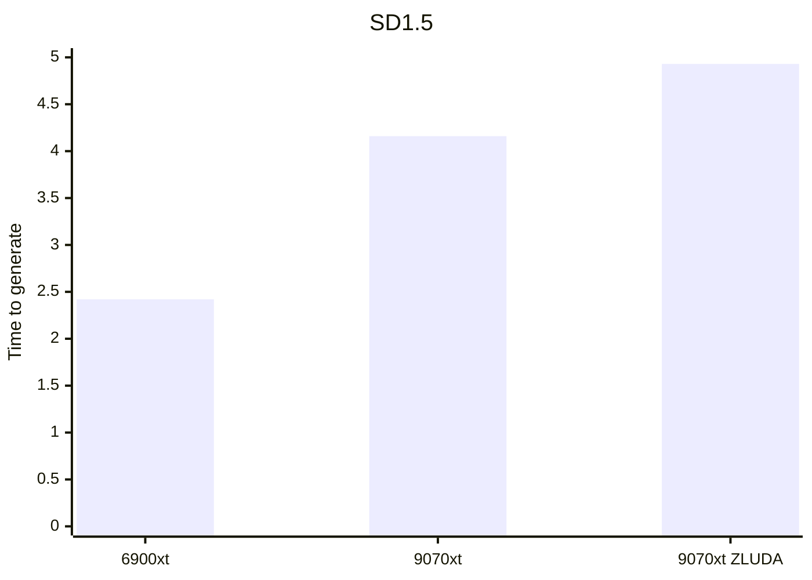
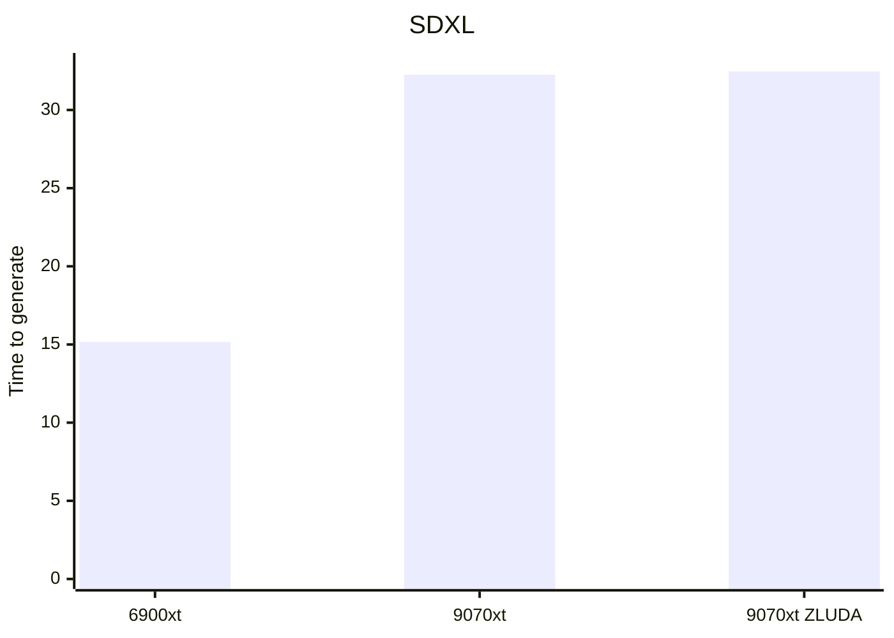

# state of ROCm on Radeon RX 9000 series

> **Issue #4443**
> **状态**: closed
> **创建时间**: 2025-03-04T00:34:00Z
> **更新时间**: 2025-06-05T02:42:40Z
> **关闭时间**: 2025-05-26T15:35:46Z
> **作者**: shenth222
> **标签**: 
> **URL**: https://github.com/ROCm/ROCm/issues/4443

## 描述

1. Could you please tell me if the latest version of ROCm supports the 9000 series?
2. If it doesn't, approximately when will support be provided? 
3. Compared to the 7000 series, what new features will the new architecture of the 9000 series introduce to ROCm? 
4. For adapting and developing on a self-developed CPU, which series do you recommend more, the 9000 series or the 7000 series?

---

## 评论 (55 条)

### 评论 #1 — NicholasFlamy (2025-03-06T16:12:21Z)

A 9070 XT will be tested on https://github.com/immich-app/immich/pull/16613 at some point.

---

### 评论 #2 — mertalev (2025-03-07T20:54:35Z)

I can confirm ROCm 6.3.1 works on the 9070 and 9070 XT.

---

### 评论 #3 — alshdavid (2025-03-18T04:32:15Z)

> I can confirm ROCm 6.3.1works on the 9070 and 9070 XT.

Did you need anything special to enable it? My 9070xt is in the mail and will do a fresh Fedora install to kick it off. 

Can you use the built-in AMD drivers in the kernel or do you need to install the pro ones from AMD's website? Do you need to set the `HSA_OVERRIDE_GFX_VERSION` variable?

I normally follow [this tutorial](https://drew-gilliesbc.medium.com/how-to-get-rocm-running-in-docker-to-do-machine-learning-on-your-amd-gpu-a521ed72b0fd) to get it running on my 6900xt 

---

### 评论 #4 — mertalev (2025-03-18T05:34:16Z)

I tested it with Arch and the `rocm/dev-ubuntu-22.04:6.3.1-complete` Docker image (later upgraded to 6.3.4, which also works). I also have `mesa` and `vulkan-radeon` installed, but I'm not sure which (if any) are needed for it to work.

---

### 评论 #5 — sofiageo (2025-03-18T07:28:40Z)

@mertalev There are also official and unofficial packages for ROCm on Arch. The official is packages [rocm-opencl-sdk](https://archlinux.org/packages/extra/any/rocm-opencl-sdk/) and [rocm-hip-sdk](https://archlinux.org/packages/extra/any/rocm-hip-sdk/)

The unofficial is [opencl-amd](https://aur.archlinux.org/packages/opencl-amd) and [opencl-amd-dev](https://aur.archlinux.org/packages/opencl-amd-dev) - The difference is the unofficial is based on the ubuntu built packages and it's usually faster to release. 

---

### 评论 #6 — OlexandrToloshnyak (2025-03-18T11:56:33Z)

Has anyone managed to make 9070xt work in WSL? 
I did `amdgpu-install -y --usecase=wsl,rocm --no-dkms`, but `rocminfo` displays only iGPU agent

---

### 评论 #7 — alshdavid (2025-03-20T12:37:56Z)

Installed Kubuntu 20.04 (kernel 6.11), amd pro drivers (rocm 6.3) and pytorch preview. No updates to the kernel or anything custom. It runs slower than my 6900xt at the moment. Same result on Fedora 42 beta (kernel 6.14) without the pro drivers.

Installed comfyui and stable diffusion, `radeontop` shows 100% usage during generation so I assume it's working. These are using `euler_ancestral`

CPU is 7950x with 98gb RAM.

|Card|Model|Steps|Resolution|It/s|Time|Notes|
|-----|------|------|----------|---|-----|------|
|6900xt|SD1.5|20|512x512|8.82|2.42s||
|9070xt|SD1.5|20|512x512|6.25|4.16s||
|9070xt|SD1.5|20|512x512|4.34|4.93s|Windows ZLUDA|
|6900xt|SDXL|20|1024x1024|1.62|15.16s||
|9070xt|SDXL|20|1024x1024|1.03|FAIL|Crashed with out of memory|
|9070xt|SDXL|20|1024x1024|1.03|32.25s|Used manual tiled VAE decoder to avoid OOM failure|
|9070xt|SDXL|20|1024x1024|1.38|32.47s|Windows ZLUDA|





---

### 评论 #8 — sofiageo (2025-03-21T07:52:10Z)

If you take a look at https://github.com/ROCm/hipBLASLt/pull/1715 you can see next rocm versions will have up to 130% of more performance in stable diffusion just from that PR

---

### 评论 #9 — Buzzlez (2025-03-21T09:57:07Z)

Its working with zluda in sd.next and forgeui and doesnt have the vae oom problems. Its running cyberrealistic Pony with 1.8 s/it, so I think theres quite a bit of headroom

---

### 评论 #10 — alshdavid (2025-03-21T11:40:13Z)

> Its working with zluda in sd.next and forgeui and doesnt have the vae oom problems. Its running cyberrealistic Pony with 1.8 s/it, so I think theres quite a bit of headroom

That's pretty good. I couldn't get sd.next to launch at all. It kept getting to the end of the start up script then fail silently 😅

I must have missed something in the set up instructions

---

### 评论 #11 — Buzzlez (2025-03-21T11:46:35Z)

I just followed this steps: https://github.com/vladmandic/sdnext/wiki/ZLUDA and downloaded the unofficial rocBLAS Library from here https://github.com/likelovewant/ROCmLibs-for-gfx1103-AMD780M-APU/releases/tag/v0.6.2.4 (the gfx1201 one). After replacing the files in the rocm folder (as explained in the first link) and rebooting the pc it worked without any problems


---

### 评论 #12 — alshdavid (2025-03-22T00:38:35Z)

@Buzzlez, I posted my steps to reproduce in [this issue](https://github.com/vladmandic/sdnext/issues/3835). Any chance you could take a look and let me know if I missed a step? 🙏

---

### 评论 #13 — sidietz (2025-03-22T23:05:12Z)

Is there actually a supported linux distribution for RDNA4 / 9070 (XT) / 9000 series? The release notes of mesa state support for RDNA4 from version 25.0 onwards, but Ubuntu 24.04 (for example) ships only mesa 24.x.

---

### 评论 #14 — Mayukh-Banik (2025-03-25T20:23:10Z)

Does anyone have a reproducible way of getting ROCm support for 9000 series on Windows/WSL? I'm trying on Ubuntu 24.04, but I'm not able to get it to work.

---

### 评论 #15 — sascharo (2025-03-26T06:46:40Z)

> I'm trying on Ubuntu 24.04, but I'm not able to get it to work.

Did you figure it out?

---

### 评论 #16 — alshdavid (2025-03-26T07:00:21Z)

@sidietz, Fedora 42 beta works out of the box for me - but runs very slow/crashes (exact same behaviour as the pro drivers on Ubuntu)

---

### 评论 #17 — Mayukh-Banik (2025-03-27T01:48:49Z)

> > I'm trying on Ubuntu 24.04, but I'm not able to get it to work.
> 
> Did you figure it out?

Nope, I think its an issue with WSL itself, but I got it running on Ubuntu native instantly, so its probably a WSL integration issue.

---

### 评论 #18 — sascharo (2025-03-29T11:10:59Z)

> I got it running on Ubuntu native instantly, so its probably a WSL integration issue.

Does it run stable?

---

### 评论 #19 — natervader (2025-03-29T22:34:48Z)

I haven't gotten it working on NixOS yet, even after running mesa 25.0.x. Not sure what else I could try but wanted to mention it here as well. 

I'm just assuming it'll be something that'll get ironed out in the next few months.

---

### 评论 #20 — alshdavid (2025-04-01T23:29:18Z)

Got it running with ZLUDA under Windows. It doesn't crash with OOM errors, but it runs quite slowly. Updated my chart above with details

---

### 评论 #21 — kodxana (2025-04-02T16:50:43Z)

Any ideas on updated on Windows ROCm works on Linux nope.

---

### 评论 #22 — fishd72 (2025-04-04T22:15:34Z)

I've been using Stable Diffusion WebUI reForge via Stability Matrix on Fedora 41, which is fully patched.

I had to manually enter the associated venv for SD reForge and update the version of `torch` and `torchvision` to ROCM compatible versions using `pip install --pre torch==2.8.0.dev20250327+rocm6.3 torchvision==0.22.0.dev20250328+rocm6.3 --index-url https://download.pytorch.org/whl/nightly/rocm6.3`... once this was done I can render images using models like cyberrealistic pony, but only at 512x512 resolution. If I try at the recommended 1024x1024, I get OOM errors about 95-97% of the way through. Changing to different pony based models, or Illustrious based models makes no difference.

Hopefully this is something that will clear up shortly... my old RX6800 renders at these resolutions just fine with only 16GB of VRAM, so hoping that eventually the 9070XT gives a performance boost.

Currently seeing around 4.95it/s at 512x512 using CyberrealisticPony v8.5

**EDIT:** Actually, allowing the image generation to run at 1024x1024 sees a message `WARNING:root:Warning: Ran out of memory when regular VAE decoding, retrying with tiled VAE decoding.` ... but if I leave it, it will eventually finish the render successfully... but reports 4.40s/it (note: `s/it`, rather than `it/s` as expected).

**EDIT of the EDIT:** Further reading has me adding `--no-half-vae --opt-sub-quad-attention` to my runtime arguments (I previously _only_ used `--opt-sub-quad-attention` with my RX6800) and this now results in renders of 1024x1024 completing with 1.58s/it ... so, still slower than my RX6800 (which was around 1.2it/s), but better than before.


---

### 评论 #23 — fishd72 (2025-04-05T15:54:24Z)

Appreciate (now I'm awake and have had coffee) that I've made a comment about Pytorch nightly ROCM on the official ROCM forum.

I have tried the version of torch & torchvision from https://repo.radeon.com/rocm/manylinux/rocm-rel-6.3.4/ and this gives drastically worse performance than the one at Pytorch.org. 

So looking forward to some updated information from AMD on ROCM support for this card.

---

### 评论 #24 — asiermarin (2025-04-10T10:25:19Z)

> Appreciate (now I'm awake and have had coffee) that I've made a comment about Pytorch nightly ROCM on the official ROCM forum.
> 
> I have tried the version of torch & torchvision from https://repo.radeon.com/rocm/manylinux/rocm-rel-6.3.4/ and this gives drastically worse performance than the one at Pytorch.org. 
> 
> So looking forward to some updated information from AMD on ROCM support for this card.

I'am currently working with ROCm 6.3.3 with 9070 xt. What it is the best/safest way to upload to 6.3.4? (Ubuntu 24.04)

---

### 评论 #25 — tip0un3 (2025-04-11T13:35:32Z)

I'm hoping for an update from ROCm as I've upgraded from an RTX 3070 to an RX 9070 XT and I'm quite disappointed. I knew Nvidia was better for AI but not to this extent... I tested under Windows 10 Forge UI as I had on my RTX with CUDA. With the 9070 XT, the HIP SDK and the gfx1201 library, it works, but performance is very poor compared with my old RTX 3070. On the order of 3 to 6 times slower, depending on the model (SDXL, Flux, etc.).

---

### 评论 #26 — Eskuero (2025-04-11T16:34:26Z)

It seems 6.4.0 [was just tagged](https://github.com/ROCm/rocm-core/releases/tag/rocm-6.4.0)? 

Alongside a [hipblast release](https://github.com/ROCm/hipBLASLt/releases/tag/rocm-6.4.0) that should include now [these improvements](https://github.com/ROCm/hipBLASLt/pull/1715/files)?

---

### 评论 #27 — sofiageo (2025-04-12T08:26:55Z)

If you are on Arch Linux you can already try 6.4.0 using [opencl-amd-dev](https://aur.archlinux.org/packages/opencl-amd-dev) package. I already see the best performance on my 5700XT yet, so I guess it will be much better for recent GPUs

---

### 评论 #28 — alshdavid (2025-04-12T11:27:03Z)

@sofiageo can you recommend a distro? I don't want to hand roll Arch from scratch 😆 Does something like Manjaro have access to 6.4.0?

---

### 评论 #29 — sofiageo (2025-04-12T11:46:17Z)

> [@sofiageo](https://github.com/sofiageo) can you recommend a distro? I don't want to hand roll Arch from scratch 😆 Does something like Manjaro have access to 6.4.0?

I think it does because it uses the same AUR repository as Arch Linux. Garuda Linux definitely has an updated [package](https://gitlab.com/chaotic-aur/pkgbuilds/-/tree/main/opencl-amd) as well.

---

### 评论 #30 — alshdavid (2025-04-14T04:30:51Z)

@sofiageo did you have to do anything specific? Installed Manjaro and trying to install rocm and I'm getting 6.3.3 🤔 Also pytorch 2.6 and nightly fail to install

---

### 评论 #31 — sofiageo (2025-04-14T06:07:57Z)

Check my first [comment](https://github.com/ROCm/ROCm/issues/4443#issuecomment-2731946934), there are two different packages, the official and the unofficial. If you want to try 6.4 now you need to install the unofficial (which I'm maintaining)

---

### 评论 #32 — alshdavid (2025-04-14T06:15:44Z)

Did you install pytorch nightly or normal pytorch 2.6.0? 

---

### 评论 #33 — asiermarin (2025-04-14T06:31:43Z)

So, with the release of [6.4.0](https://rocm.docs.amd.com/en/docs-6.4.0/about/release-notes.html) still not an official support for RX 9000 series. Someone has already tested the performance with this new release?

---

### 评论 #34 — Kr1s1m (2025-04-18T16:28:14Z)

Managed to set up working PyTorch CUDA environment using an RX 9070 (56 CU non-XT version) on Windows 11 via WSL Ubuntu 24.04.2 LTS, ROCm 6.4.0, Pyhon 3.12.3, Pip3 25.0.1, PyTorch 2.6.0 using this [reddit guide](https://www.reddit.com/r/ROCm/comments/1ep4cru/rocm_613_complete_install_instructions_from_wsl/) and changing the wget links from it to the latest cp312 versions found in [amd repo](https://repo.radeon.com/) and using the `libhsa-runtime64.so.1.14.0` file to replace `libhsa-runtime64.so` on last copy command from the the **updating to the WSL compatible runtime lib** section of the reddit guide. My pip install command was: 
`pip3 install torch-2.6.0+rocm6.4.0.git2fb0ac2b-cp312-cp312-linux_x86_64.whl torchvision-0.21.0+rocm6.4.0.git4040d51f-cp312-cp312-linux_x86_64.whl torchaudio-2.6.0+rocm6.4.0.gitd8831425-cp312-cp312-linux_x86_64.whl pytorch_triton_rocm-3.2.0+rocm6.4.0.git6da9e660-cp312-cp312-linux_x86_64.whl numpy==1.26.4`

When I run `torch.cuda.get_device_name(0)` and `torch.cuda.is_available()` I get `AMD Radeon RX 9070` and `True`. The performance is not exactly amazing since my AVX512 processor (Ryzen 7 7700) takes 20 minutes per epoch (on a given NLP project I was working on) while the RX 9070 is utilized about 55% during training and took about 4 minutes (only around 5x faster). A single square matrix multiplication of size 100000 was just about twice as fast compared to AVX512 processor (7700). This is probably because there is still no official support.

---

### 评论 #35 — tip0un3 (2025-04-19T22:07:19Z)

I had kept all my generation times with my old RTX 3070. I compared it with the RX 9070 XT and posted a comparison on Reddit. It's really not glorious... I'm hoping for optimization and official support :
https://www.reddit.com/r/StableDiffusion/comments/1k376lm/performance_comparison_nvidiaamd_rtx_3070_vs_rx

---

### 评论 #36 — roufpup (2025-05-04T09:18:13Z)

+1 what is the current status for the official support for the RX 9000s series, are we going to see any development soon?

---

### 评论 #37 — sascharo (2025-05-04T11:43:33Z)

> +1 what is the current status for the official support for the RX 9000s series, are we going to see any development soon?

I thought AMD had said already during the launch that official support will most likely come in autumn 2025.

---

### 评论 #38 — alshdavid (2025-05-04T21:58:01Z)

As an Australian, it's currently autumn lol

---

### 评论 #39 — roufpup (2025-05-05T06:42:06Z)

> > +1 what is the current status for the official support for the RX 9000s series, are we going to see any development soon?
> 
> I thought AMD had said already during the launch that official support will most likely come in autumn 2025.

If that is the case i apologize i must have missed that information, thank you for clarifying.

---

### 评论 #40 — alshdavid (2025-05-13T13:53:49Z)

Just tried ROCm 6.4.0 on Fedora rawhide (the beta stream of Fedora). With SDXL @ 1024x1024 it still crashes with OOM errors when using the default VAE decoder in ComfyUI. Using the tiled decoder it takes 30s to generate so ~3 seconds faster than before 

---

### 评论 #41 — leonardopereira10 (2025-05-17T00:15:54Z)

nothing for windows suport?


---

### 评论 #42 — sascharo (2025-05-17T10:11:42Z)

> nothing for windows suport?

I assume AMD has written off Windows support long time ago for any work by clients worth their attention.

---

### 评论 #43 — sidietz (2025-05-21T19:40:33Z)

It seems that AMD [just released rocm 6.4.1 with RX 9000 series support.](https://www.phoronix.com/news/AMD-ROCm-6.4.1-Released)

---

### 评论 #44 — tip0un3 (2025-05-21T19:55:56Z)

> It seems that AMD [just released rocm 6.4.1 with RX 9000 series support.](https://www.phoronix.com/news/AMD-ROCm-6.4.1-Released)

Tested 6.4.1 today. I can't see any difference with version 6.4.0, it's even a little slower. I really hesitate to go back to NVIDIA. How can you get performance 2 to 6 times worse than a 5-year-old NVIDIA card? It's just ridiculous. A priori, official compatibility doesn't mean performance gains. It's just easier to install with official documentation.

---

### 评论 #45 — sascharo (2025-05-22T07:19:39Z)

> A priori, official compatibility doesn't mean performance gains. It's just easier to install with official documentation.

Right, they didn't announce any performance improvements yesterday, as far as I know.

At least the official Linux support is out now.

---

### 评论 #46 — Kr1s1m (2025-05-22T07:23:02Z)

Nothing useful yet. But they announced (CES 2025) that support is coming in Q3 with the release of the R9700 pro cards, which will include support for Windows without WSL.

---

### 评论 #47 — sascharo (2025-05-23T14:25:33Z)

> support for Windows without WSL

I believe it when I see it working on my box. 😉 

---

### 评论 #48 — alshdavid (2025-05-25T03:37:06Z)

Here are my updated benchmarks with ROCm 6.4.1 using the proprietary AMD drivers on Ubuntu 24.04 via ComfyUI

|Card|Model|Steps|Resolution|Time|Notes|
|-----|------|------|----------|----|------|
|6900xt|SD1.5|20|512x512|2.42s|ROCm 6.3|
|9070xt|SD1.5|20|512x512|3.76s||
|6900xt|SDXL|20|1024x1024|15.16s|ROCm 6.3|
|9070xt|SDXL|20|1024x1024|FAIL|Crashed with out of memory|
|9070xt|SDXL|20|1024x1024|30.51s|Used manual tiled VAE decoder to avoid OOM failure|

So it's basically exactly the same as it was before support was added. Still has OOM errors, generation is negligibly faster

---

### 评论 #49 — Eskuero (2025-05-25T10:11:58Z)

I get similar crashes on ComfyUI and AUTO111 on my 9070 XT no matter what I do. However using SDNext from master branch with latest nightly pytorch under Arch Linux with ROCM 6.4 and BF16 I get stable generations (the first generation on each startup or resolution swap is slower but it stabilizes on followup). Also using certain enviroment variables improve performance for quite a bit.

---
```
export TORCH_COMMAND="--pre torch torchvision torchaudio pytorch-triton-rocm --index-url https://download.pytorch.org/whl/nightly/rocm6.4"
```

| Model  | Steps | Resolution | Speed | Time | Notes |
| ------------- | ------------- | ------------- | ------------- | ------------- | ------------- |
| Hassaku XL (Illustrious)  | 20  | 512x512  | 7.79it/s | 3.13s  | pipeline: 2.64, decode: 0.38, preview: 0.31, offload: 0.29, move: 0.1, prompt: 0.08 |
| Hassaku XL (Illustrious)  | 20  | 1024x1024  | 1.91it/s | 11.94s  | pipeline: 10.8, preview: 3.4, decode: 1.07, gc: 0.28, offload: 0.28, move: 0.05 |
| Hassaku XL (Illustrious)  | 20  | 1536x1536  | 1.96s/it | 1m 7.09s | pipeline: 39.33, decode: 27.69, preview: 13.08, gc: 0.51, offload: 0.5  |

---
```
export PYTORCH_TUNABLEOP_ENABLED=1
export TORCH_COMMAND="--pre torch torchvision torchaudio pytorch-triton-rocm --index-url https://download.pytorch.org/whl/nightly/rocm6.4"
```

| Model  | Steps | Resolution | Speed | Time | Notes |
| ------------- | ------------- | ------------- | ------------- | ------------- | ------------- |
| Hassaku XL (Illustrious)  | 20  | 512x512  | 9.12it/s | 2.75s  | pipeline: 2.26, offload: 0.36, decode: 0.33, preview: 0.29, move: 0.15, prompt: 0.14 |
| Hassaku XL (Illustrious)  | 20  | 1024x1024  | 2.30it/s | 9.95s  | pipeline: 8.97, preview: 2.74, decode: 0.94, gc: 0.26, offload: 0.2 |
| Hassaku XL (Illustrious)  | 20  | 1536x1536  | 2.13s/it | 1m 11.85s | pipeline: 42.83, decode: 28.94, preview: 10.43, gc: 0.51, offload: 0.48  |

---
```
export TORCH_ROCM_AOTRITON_ENABLE_EXPERIMENTAL=1
export TORCH_COMMAND="--pre torch torchvision torchaudio pytorch-triton-rocm --index-url https://download.pytorch.org/whl/nightly/rocm6.4"
```

| Model  | Steps | Resolution | Speed | Time | Notes |
| ------------- | ------------- | ------------- | ------------- | ------------- | ------------- |
| Hassaku XL (Illustrious)  | 20  | 512x512  | 9.51it/s | 2.70s  | pipeline: 2.21, decode: 0.39, preview: 0.38, offload: 0.28, move: 0.09, prompt: 0.07 |
| Hassaku XL (Illustrious)  | 20  | 1024x1024  | 2.81it/s | 8.84s  | pipeline: 7.45, preview: 2.61, decode: 1.35, offload: 0.47 |
| Hassaku XL (Illustrious)  | 20  | 1536x1536  | 1.12it/s | 44.55s | decode: 25.29, pipeline: 19.19, preview: 10.86, offload: 0.29, gc: 0.26  |

---
```
export PYTORCH_TUNABLEOP_ENABLED=1
export TORCH_ROCM_AOTRITON_ENABLE_EXPERIMENTAL=1
export TORCH_COMMAND="--pre torch torchvision torchaudio pytorch-triton-rocm --index-url https://download.pytorch.org/whl/nightly/rocm6.4"
```

| Model  | Steps | Resolution | Speed | Time | Notes |
| ------------- | ------------- | ------------- | ------------- | ------------- | ------------- |
| Hassaku XL (Illustrious)  | 20  | 512x512  | 11.19it/s | 2.25s  | pipeline: 1.88, decode: 0.34, preview: 0.29, offload: 0.22 |
| Hassaku XL (Illustrious)  | 20  | 1024x1024  | 3.6it/s | 7.28s  | pipeline: 5.96, preview: 1.88, decode: 1.05, gc: 0.27, offload: 0.23 |
| Hassaku XL (Illustrious)  | 20  | 1536x1536  | 1.33it/s | 42.12s  | decode: 26.23, pipeline: 15.81, preview: 8.19, gc: 0.26, offload: 0.26  |

---

Theorically enabling CK should improved performance more but I couldn't get it [to compile](https://vladmandic.github.io/sdnext-docs/AMD-ROCm/#composable-kernel-ck-flash-attention) for gfx1201


---

### 评论 #50 — kasper93 (2025-05-25T11:05:39Z)

@Eskuero: Please use pytorch from https://repo.radeon.com/rocm/manylinux/rocm-rel-6.4.1/ it works better than upstream version. Also `TORCH_ROCM_AOTRITON_ENABLE_EXPERIMENTAL=1` and `--use-pytorch-cross-attention` (for comfyui) is good for performance, not sure what equivalent for a1111 is.

EDIT: Though I seem to get similar performance to your last table, so probably not that relevant.

---

### 评论 #51 — alshdavid (2025-05-25T23:57:14Z)

I retried with:
```
export PYTORCH_TUNABLEOP_ENABLED=1\
export TORCH_ROCM_AOTRITON_ENABLE_EXPERIMENTAL=1
export TORCH_COMMAND="--pre torch torchvision torchaudio pytorch-triton-rocm --index-url https://download.pytorch.org/whl/nightly/rocm6.4"

python ./main.py --use-pytorch-cross-attention 
```

Again, ComfyUI under Ubuntu 24.04, Python 3.10.17 ([static build](https://github.com/astral-sh/python-build-standalone/releases)), proprietary AMD drivers, ROCm 6.4.1 and pytorch nightly (from the install script on the pytorch website). Now it doesn't run out of memory when using the standard VAE decoder.

|Model|Steps|Resolution|Speed|Time|Notes|
|-|-|-|-|-|-|
|Pony 6|20|1024x1024|1.49it/s|34.56s||
|Pony 6|20|1024x1024|1.5it/s|27.76s|Manual tiled VAE decoder|

> Please use pytorch from https://repo.radeon.com/rocm/manylinux/rocm-rel-6.4.1/ it works better than upstream version.

I took a look but am not sure how to install the version from there

---

### 评论 #52 — tip0un3 (2025-05-26T11:07:21Z)

Interesting! Too bad I gave up after getting no improvement with ROCm 6.4.1 from the AMD repository and I couldn't stand Out Of Memory anymore. I removed my Ubuntu out of rage because I no longer had the patience... I ordered an RTX 5070 Ti, I was weak.
In terms of performance, it's already better, but I don't regret going back to the greens. AMD is too far behind, and I'm fed up with not being able to test new AI features because they're still only compatible with CUDA.

---

### 评论 #53 — harkgill-amd (2025-05-26T15:35:46Z)

As @sidietz mentioned, ROCm 6.4.1 includes official support for the 9070 and 9070XT. You can find more information regarding the new additions over on the [release notes](https://rocm.docs.amd.com/en/latest/about/release-notes.html#rocm-6-4-1-release-notes). 

@alshdavid and @Eskuero, could you please create new issues with your workflows so we can further investigate the performance discrepancies? The 9000 series cards are still fairly new and we're actively improving them on all fronts. Reports/findings such as the ones you've shared will be a great help in getting these issues addressed as quickly as possible. I'll be closing this thread out so that any real issues don't get lost in the discussion but please be sure to file a separate issue report should you encounter any problems with ROCm on the 9070/9070XT. Thanks! 

EDIT: For the ComfyUI/Stable Diffusion performance issues, the [MIGraphX node for ComfyUI](https://github.com/pnikolic-amd/ComfyUI_MIGraphX) helps significantly improve performance. You can find more information including how to install and use the node over at the [Install ComfyUI and MIGraphX extension](https://rocm.docs.amd.com/projects/radeon/en/latest/docs/advanced/comfyui/installcomfyui.html#install-comfyui-and-migraphx-extension) page.

---

### 评论 #54 — alshdavid (2025-05-30T10:18:08Z)

Sure: https://github.com/ROCm/ROCm/issues/4846

---

### 评论 #55 — alshdavid (2025-06-05T02:42:39Z)

@harkgill-amd I just gave MIGraphX a shot but it appears that it either only supports SD3/SD3.5 or there is another issue with my set up. Raised an issue on the repo as a sanity check https://github.com/pnikolic-amd/ComfyUI_MIGraphX/issues/5

---
